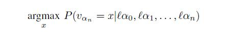
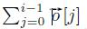
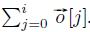
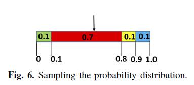

# Abstract

已经提出许多设计来改进自动化移动手机测试。尽管有这些改进，但提供适当的文本输入仍然是一个突出的障碍，这阻碍了大规模采用自动化测试方法。关键的挑战是如何在用例上下文中自动生成最相关的文本。例如，应在移动浏览器应用程序的地址栏中输入有效的网站地址，以继续测试应用程序;应在音乐推荐应用的搜索栏中输入歌手的姓名。如果没有正确的文本输入，测试将会卡住。我们提出了一种新颖的基于深度学习的方法来应对挑战，将问题简化为最小化问题。另一个挑战是如何使该方法通常适用于受过训练的应用程序和未经训练的应用程序。我们利用Word2Vec模型来应对挑战。我们已经将我们的方法构建为工具，并使用包括Firefox和Wikipedia在内的50种iOS移动应用程序对其进行评估。结果表明，我们的方法明显优于现有的自动文本输入生成方法。

| relevant information |      |
| -------------------- | ---- |
| *作者*               |      |
| *单位*               |      |
| *出处*               |      |
| *原文地址*           |      |
| *源码地址*           |      |
| *发表时间*           |      |

# I. 简介

移动设备已成为我们生活中不可或缺的一部分。移动应用程序是提供各种便捷和高质量服务的工具，例如网页浏览，娱乐，交通信息辅助，银行和社交网络。为了满足日益增长的需求，移动市场正以每天1000多个新应用的速度快速增长[1] [6]。因此，开发团队一直处于激烈的竞争中，在发布截止日期前面临巨大的压力。遗憾的是，这通常会导致移动应用程序中的错误，例如运行时应用程序崩溃，UI设计中的缺陷以及未完全实现的功能。

移动测试的目标是在应用程序发布之前发现它们中的错误。有两种主流的移动测试方法：手动测试和自动monkey测试。在手动测试中，测试人员手动执行操作以尽可能多地运用用例。这种方法的缺点是需要大量的人力，因为测试人员需要在整个测试期间与应用程序密切交互。此外，通常专注于演示常见用例中的功能的人类测试人员可能经常会错过可能触发异常的极端情况。

自动化monkey测试[8]，[28]，[18]，[19]，[37]，[21]，[20]，[24]，[27]被提议用于减少人类的努力并最大化用例覆盖率。 “monkey”是描述这种测试如何运作的隐喻;像monkey一样，该工具执行随机动作序列，包括单击UI视图（或UI屏幕）上的按钮并执行随机击键。为了涵盖尽可能多的动作序列，研究人员提出了各种新颖的搜索算法，与monkey随机搜索策略形成对比。尽管有这些改进，但在monkey测试期间提供适当的文本输入仍然是一个突出的障碍，这阻碍了monkey测试方法的大规模采用。在许多用例中，大多数现有技术很难提供有意义的文本输入。例如，对于电影应用程序，monkey测试几乎无法提供有意义的输入，例如星际迷航。相反，它会产生不相关的输入，如4t6。因此，没有找到任何结果，从而使Monkey无法前往显示适当结果的屏幕。手动规范可以缓解这个问题，但需要大量的人力。

在本文中，我们提出了一个解决方案，让Monkey自动生成相关的文本输入。有了这样的输入，Monkey可以通过长动作序列进入工作流深处的UI屏幕（简称深UI屏幕），而不是一开始就卡住。一旦它到达深度UI屏幕，Monkey可以应用其他面向bug披露的测试技术，例如基于搜索的测试[26]，符号测试生成[22]，甚至是随机测试[34]来识别复杂工作流中的错误。

## A.生成相关输入

输入生成的关键要求是生成与上下文相关的输入。
$$
Movie -> search -> star trek
$$

$$
Weather -> search -> New York
$$

在用例1中，在单击标记为“电影”的菜单项并且触发了标记为“搜索”的搜索栏后，应用程序将需要用户的电影标题。因此，输入星际迷航是相关的;在用例2中，单击标记为“天气”的菜单项并触发标记为“搜索”的搜索栏后，应用程序将使用该用户的城市名称。因此输入纽约是相关的。相反，在一个上下文中相关的输入可能在不同的上下文中不相关。例如，单击菜单项Weather时，输入Star Trek将不合适。我们还在第七节中将读者引用到更真实的例子中。

**挑战**。上述要求对自动文本输入生成提出了很大的挑战。首先，相关性特定于自然语言语义，只有人类测试者才能理解。因此，传统的自动输入生成方法，例如基于符号执行的测试[22]，是不适用的。其次，包含确定相关文本输入的信息的动作（例如，点击菜单项电影或天气）可能不会立即在动作序列中的输入动作之前。因此，维护和查找文本输入与紧接在先行动的信息之间的映射是一种难以奏效的方法。

**我们的深度学习方法**。我们提出了一种新颖的基于深度学习的方法来解决上述挑战。在高层次上，我们的解决方案包括两个阶段：在训练阶段，monkey学习测试人员的手动输入并统计地将他们与上下文相关联，例如行动历史和文本框标签;在预测阶段，monkey根据观察到的上下文自动预测文本输入。我们的方法的核心是递归神经网络（RNN）模型。这种类型的模型在许多自然语言处理（NLP）应用程序中取得了巨大成功，例如机器翻译和输入法自动完成。以输入法自动完成为例，RNN模型将单词之间的语义连接量化为非线性函数，其中参数用大的文本语料库进行训练。给定一个词，非线性函数计算其旁边的单词的概率分布，然后从分布中采样下一个单词。此外，RNN模型保持存储器状态以汇总来自先前单词的重要信息，并在推荐下一单词时将其用作另一输入源。据我们所知，我们是第一个将深度学习应用于自动测试移动设备的文本输入生成问题的人。

根据Mikolov等人的实证研究 [32]，RNN模型比传统的统计模型（如n-gram模型和隐马尔可夫模型）更精确。具体而言，与传统模型相比，RNN导致18％的误差减少，假设它们在相同的数据上训练，并且即使传统模型训练的数据比RNN模型多5倍，也导致12％的误差减少。

## B.与应用无关的输入生成

输入生成的另一个重要要求是应用独立性。这意味着在一组应用程序上训练的RNN模型也应该适用于其他应用程序。

**挑战**。在不同的应用程序中使用不同的单词来表示相同的概念对应用程序独立性提出了重大挑战。
$$
Film -> search -> ?
$$
假设在训练阶段没有看到标签Film。人类测试人员可以很容易地找出用例1中标签movie和film之间的语义相似性。因此，我们可以预测相关的文本输入 - 例如，星际迷航。然而，RNN模型完全忽略了标签film，因为它没有出现在训练阶段。因此，RNN模型无法预测标签Film的相关文本输入。

**我们基于Word2Vec的解决方案**。我们通过从Google新闻语料库统计学习同义词的人类知识来应对挑战。同义词存储在等价类中。每个等价类的代表用于替换训练和预测期间属于该类的单词。

我们的方法建立在Word2Vec模型的基础上，这是NLP研究人员最近提出的统计模型。该模型将一个单词映射到一个向量，向量之间的距离测量单词的相似性。 Word2Vec模型通过求解优化问题来学习矢量编码。具体而言，它最小化相似单词之间的距离，并最大化不相关单词之间的距离。 Word2Vec是一种无监督学习算法，这意味着它不需要手动标记训练数据。Word2Vec在结果质量方面优于其他现有模型[33]。这主要是因为Word2Vec可以训练比先前工作多2到3个数量级的数据，而这只是之前工作所需时间的一小部分。

我们已经构建了一个工具，并使用50个iOS应用程序对其进行评估，包括Firefox和Wikipedia等热门应用程序。评估结果证实了我们的方法的有效性。

RNN预测平均将Monkey测试的覆盖率提高了21％，而RNN模型和Word2Vec模型的组合将覆盖率提高了28％。
此外，如果我们排除基准套件中可用UI屏幕很少的简单应用程序，我们发现RNN预测可将覆盖率提高46％，两种模型的组合可提高60％。同样重要的是，我们的预测非常有效，通常在1毫秒内完成。

总之，我们在本文中做出以下贡献：

- 我们提出了一种基于深度学习的新方法，以自动生成移动UI测试的相关文本输入。
- 我们提出了Word2Vec NLP模型的新颖组合，以及使输入生成应用独立的学习。
- 我们已将我们的方法作为一个系统实施，并对包括Firefox和Wikipedia在内的50个iOS应用程序进行了实验。结果表明，我们的方法显着增加了Monkey测试的覆盖范围。

# II.系统设计概述

系统设计如图1所示。monkey测试引擎通过单击屏幕上的按钮来探索移动应用程序。当遇到文本框时，它会从文本输入服务器请求相关输入，如1、2所示。服务器通过进一步将其分派给人工测试人员或RNN运行实例来解析请求，该实例对应于两种模式：手动模式和AI模式。在手动模型中，在收到帮助请求3后，人工测试人员可以输入与上下文相关的文本输入4。如果她认为上下文不符合实际中的任何动作序列，则忽略它。然后，由测试者录入的输入和相应的上下文记录在与服务器相关联的数据库中。在AI模式中，我们首先使用记录在数据库5中的训练数据集训练RNN模型，之后RNN实例可以自动预测文本输入6。

在预测阶段6中，Monkey利用RNN模型来预测给定上下文中的文本输入值。基本上，考虑到Monkey测试引擎维护的上下文，模型预测文本输入值。但是，由于我们预测输入的应用程序与我们训练模型的应用程序不同，因此RNN模型可能无法识别Monkey测试期间遇到的某些上下文信息。为了解决这一挑战，我们使用Word2Vec模型改进了RNN模型，该模型有助于识别语义相似的上下文，尽管它们具有不同的句法形式（例如，“moive”和“film”）。通过RNN模型和Word2Vec模型的新颖组合，我们有效地解决了这个问题。

在下文中，我们首先介绍第III节中的背景，然后解释我们如何应用深度学习技术来自动预测第IV节中的文本输入。
在第五节中，我们将解释实现细节。在第六节中，我们讨论了这项工作的假设。第七节介绍评估结果。

# III. 背景深度介绍

本节介绍了递归神经网络（RNN）和Word2Vec的背景。 RNN和Word2Vec都是神经网络的特殊形式。为了讨论这两个，我们首先要简要介绍一下神经网络。

神经网络（NN）有两种形式：图形形式和数学形式。在图形形式（图2a）中，NN具有输入层，输出层，一个或多个隐藏层。每个层（输入层除外）包括多个神经元，它们与前一层和下一层中的神经元相连。

每个神经元，如图2b所示，是一个基本的计算单元。它首先将沿着传入边传递的值线性组合为∑ ~i~ p~i~x~i~ + b，其中p~i~和b是要训练的参数。然后它应用激活函数f~a~，例如tanh函数[12]或sigmoid函数[11]。激活函数对于使神经元非线性非常重要。
没有激活函数，神经元仅仅是线性函数，神经网络也是线性函数，不能表征许多复杂模型。

在数学形式中，NN是由神经元代表的函数的组合。设f：R^n^→R^m^表示由神经网络表示的复合函数。设输入向量I∈R^n^表示输入层中n个神经元的输入。设输出向量O∈R^m^表示输出层中m个神经元的输出。神经网络的训练可以被视为一个优化问题：

更新参数以最小化预测输出和训练数据集上的实际输出之间的总损失，其中损失函数可以被定义为距离或其他形式。无论损失函数的复杂性如何，梯度下降算法[16]通常用于最小化其值。

A.递归神经网络

RNN是一种特殊形式的神经网络，具有反馈回路，如图3所示。为清楚起见，我们使用箭头来表示神经元之间的连接。

循环允许在网络执行步骤中导出的信息传递到下一个，类似于人类的长期记忆。图4显示了概念上展开的版本，其中神经网络在概念上被复制以通过多个步骤服务于一系列输入。

注意神经网络副本之间的连接。 RNN考虑输入法自动完成的应用，我们应用RNN生成句子“how are you doing”。这些单词一个接一个地输入到输入层。每个字在单热矢量表示中被编码以使得能够学习，例如，单词“how”被编码为[1,0,0,0]。简单地说，向量的每个条目对应于词汇表中的单词（[“how”，“are”，“you”，“doing”]），向量中值1的位置表示编码的单词。从概率的角度来看，向量表示具有100％概率的单词，而其他概率表示具有0％概率的单词。

利用初始参数设置，给定输入字与从最后一步传递的信息相结合，神经网络输出概率向量，其中第i个条目估计词汇表中的第i个单词接下来出现的概率。例如，基于输入“how”，假设它将下一个词预测为[0.4,0.2,0.1,0.3]，即，最可能的下一个词是“how”。但是，我们从训练数据集中观察到下一个单词应该是“are”。因此，训练算法需要更新参数，使得单词“are”的预测概率变得显着大于其他单词。同样，给定“are”这个词，神经网络需要预测“you”作为下一个词的概率高于其他词。 

## B.Word2Vec

Word2Vec算法学习空间R^k^中每个单词的向量表示，其中相似的单词可能具有相似的向量。 Word2Vec通常应用于非常大的语料库。为了获得更好的可扩展性，Word2Vec采用传统的神经网络结构。

Word2Vec采用的矢量表示与上述RNN中使用的单热表示明显不同。 Word2Vec将每个单词映射到空间R^k^中的实值向量，其中k远小于词汇量s，而单热表示将每个单词映射到空间{0,1}^s^中的向量。首先，通过在低维空间中编码矢量，Word2Vec降低了计算的空间复杂度。更重要的是，Word2Vec的矢量表示处于连续空间中，并且两个矢量之间的距离（即，余弦相似距离）有效地测量了单词的相似性。相反，单热表示不能测量相似性。在我们的工作中，我们将Word2Vec视为黑盒子。

# IV.将深度学习应用于输入生成

在高级别，我们的方法在统计学上学习文本输入值与训练阶段的上下文之间的相关性（第IV-B节）。然后是预测阶段（第IV-C节），一旦Monkey需要在文本框中提供某些值，我们的方法就会根据Monkey目前观察到的上下文来预测值。第IV-D节进一步解释了我们如何推广输入生成以使其独立于应用程序。为便于讨论，我们首先介绍在训练阶段使用的训练数据集（第IV-A节）。

## A.训练数据集

在不失一般性的情况下，我们假设简化的用户行为模型。在模型中，我们只对两种类型的UI元素感兴趣：按钮和文本框∈domain T~ui~。各种可点击的UI元素（如菜单和tableview单元格）具有类似于按钮的行为，因此在我们的模型中具有相同的抽象。类似地，接受用户输入的一系列文本字段（例如安全文本字段和搜索字段）被抽象为文本框。请注意，我们的实现完全支持所有这些UI元素。我们只对两种类型的动作感兴趣，tap和typeText∈T~action~，它们是UI元素∈T~ui~的最具代表性的行为。

用户动作α∈A是一个元组，包括UI元素类型τ~ui~∈T~ui~，动作类型τ~action~∈T~action~、显示在UI元素中的标签 δ（例如，图5中的按钮中的“Moive”），以及在动作中涉及的可选值v，例如文本输入值。

训练数据集基本上记录了动作序列（α~0~，α~1~，....  ，α~n~），其中α~i~表示在第i步的用户动作。 α~n~之前的子序列指的是用户到达发生α~n~的UI屏幕所采取的动作。有关动作序列的更多细节将在第VI节中讨论。

我们观察到标签δ是用户在使用应用程序时所感知的最突出的信息，考虑提供什么作为输入值。基于这种观察，我们用动作序列中的每个动作α表示标签δ~α~，同时抽象掉所有其他信息。此外，我们还对在动作α~n~中输入的输入值v~αn~感兴趣。因此，上述动作序列简单地表示为（δα~0~，δα~1~，.... ，δa~n~，va~n~ ）.为了便于演示，我们还提到δα~0~，δα~1~，.... ，δa~n~作为输入值vα~n~的上下文。

考虑图5中的示例，假设测试人员执行操作以触发UI屏幕转换并输入输入值。在第一个屏幕中，测试人员点击（或点击）标有“Moive”的按钮，通向第二个屏幕，搜索栏标有“搜索”。在第三个屏幕中，测试仪在搜索栏中输入输入值“Star Trek”。
在用户操作模型之后，我们有两个操作：单击带有标签Movie的按钮，然后在搜索栏中输入带有标签Search的“Star Trek”。因此，记录的序列是“Moive”，“search”，“star Trek”。 

## B.训练阶段

不失一般性，我们假设每个标签δ或输入值v是单个单词，而不是短语。第VI节介绍了一种确保假设的简单预处理。

设Vocabulary V =L∪Val表示训练数据集中出现的所有标签和输入值的列表。在下文中，除非另有说明，否则我们不区分标签和输入值。相反，我们用一般术语词来引用它们。

为了实现学习，我们提出了每个单词的以下向量表示。给定单词ω，其矢量形式ω‘具有与词汇相同的大小。并且向量的每个条目被定义为，

因为只有一个条目可以取值1，所以向量表示也被称为单热表示。考虑图4.在步骤2，输入向量为[0,1,0,0]，如输入层所示。

在每个步骤，RNN模型接受单词的向量表示作为输入。输入以及隐藏层的先前状态（也被编码为矢量）用于预测输出，该概率矢量表征序列中接下来出现的每个单词的概率。训练的目标是更新RNN模型的参数，使得下一个词的预测概率分布接近从数据集观察到的真实概率分布。

我们将训练正式化为优化问题：

给定上下文δα~0~，δα~1~，....，δa~n~，我们找到具有最大条件概率的输入值vα~n~= x。在训练阶段，我们建立一个RNN模型来预测条件概率。自动计算模型的内部参数，以使预测的概率分布近似于从训练数据集中观察到的真实概率分布。然后，在假设上下文与文本框的输入值之间的概率关联没有显着改变的情况下，将训练的模型用于预测。我们在网站上解释了有关形式化的更多细节[4]。

## C.预测阶段

训练模型后，可以将其用于预测。通常，RNN模型接受一系列单词作为输入，并输出概率向量，该概率向量表征词汇表中的每个单词紧接在序列之后出现的概率（我们称之为下一个单词）。概率分布的采样将选择具有分布中描述的概率的单词。

在我们的问题设置中，当Monkey遇到文本框时，它会将动作历史记录和文本框的标签序列化为序列，然后将序列发送到训练模型以预测下一个单词的概率分布。最后，它对概率分布进行采样以获得下一个单词的值。

通常，词汇表中的任何单词都可以是下一个单词。词汇表中的单词可以对应于动作标签，文本框标签或文本输入值，但我们只对预测文本输入值感兴趣。如果采样结果不表示文本输入值（即，它不属于文本输入值的词汇表），我们将其丢弃并重新对分布进行采样。

对概率分布进行采样的想法如下。令o’ 表示RNN模型的输出向量，其表征概率分布。我们首先将0到1之间的范围分成| o '|间隔。区间i（0 ≤ i <| o '|）从开始并以结束。均匀随机变量X~U（0,1）落入具有概率o' [i]的区间，即区间的长度。换句话说，均匀随机变量X落入区间i的概率与我们选择单词＃ -  V [i]的概率相同。因此，如果随机变量落入区间i，我们返回单词V' [i]。

请考虑以下示例。假设输出概率向量为[0.1,0.7,0.1,0.1]，如图4所示。图6显示了四个间隔。假设均匀随机变量的值为0.5，则它落入区间1（注意区间为0）。因此，我们返回单词V' [1]，即单词“are”。

## D.独立于应用程序的输入生成

我们的最终目标是预测我们尚未接受过训练的应用程序的输入。主要挑战是使输入生成应用独立。

我们的想法是，如果我们遇到一个在训练阶段没有看到的单词，我们可以将它连接到在训练阶段看到的一些类似的单词，利用Word2Vec。我们使用预先使用非常大的Google新闻语料库训练的Word2Vec模型。当遇到不在词汇表中的单词时，例如，在训练期间没有出现在任何应用程序中的文本框标签时，我们的系统会查询Word2Vec以查找词汇表中最相似的单词（更确切地说，词汇表动作标签和文本框标签）。如果可以从两个单词的矢量表示计算的相似度低于预设阈值0.7，则我们认为该单词在训练数据集中没有对应物并且在预测期间简单地忽略它。在最坏的情况下，如果这个词在确定文本输入值时很重要，那么我们的技术就会降低到传统的Monkey测试。这些情况的发生主要是因为应用程序属于一个与我们训练过的应用程序类型非常不同的新类别。

# V.实现

我们在第II节中介绍了系统设计的概述。在本节中，我们将解释图1中所示的每个组件的实现细节。

**a）Monkey测试引擎**：我们的monkey在探索动作序列时采用深度优先搜索策略，即在填充当前屏幕中所有文本框元素的值之后逐个点击可用按钮。可以以随机顺序或以某种顺序（例如，按钮标签的字母顺序）单击同一屏幕内的按钮。我们实现了两个选项并在我们的实验中采用了随机顺序。另外，为了避免重复探索同一个屏幕，我们构建了每个屏幕的签名，其中包括屏幕标题和屏幕中按钮的标签。具有相同签名的屏幕被视为同一屏幕，仅被探索一次。

请注意，除文本输入外，我们的系统还可以轻松扩展以预测下一步操作。然而，我们认为这会不利地限制Monkey实现良好覆盖的能力，因为它往往会跟随人类测试者的动作序列，这些动作序列是有限的。因此，我们系统的一个重要设计原则是使用随机探索动作和RNN预测文本输入。

我们使用Xcode IDE附带的测试自动化框架XCTest实现了iOS Monkey。该框架提供了一组API [9]，允许我们在屏幕中找到按钮或文本框元素。例如，我们可以使用以下API调用轻松找到当前屏幕中的所有按钮：

descendantsMatchingType（.Button）

**b）文本输入服务器**：使用python web框架Bottle [2]实现的文本输入服务器是一个隐藏了如何生成输入的详细信息的抽象层。由于它是用Python实现的，而Monkey测试引擎是在Swift中实现的，因此两个组件之间存在编程语言障碍。为了打破障碍，他们通过以JSON格式发送HTTP消息来相互通信。输入服务器通过函数调用与RNN实例通信，因为它们都是用Python实现的。此外，我们为输入服务器维护了一个数据库，用于存储人类测试人员在某些上下文中输入的输入。我们采用了MongoDB [7]。输入服务器使用Python驱动程序PyMongo [10]与数据库交互。

**c）RNN实例**：我们在Python深度学习框架Tensorflow [13]之上构建了RNN模型，它提供了高级API，同时隐藏了许多低级细节。通过Tensorflow的抽象，可以使用仅40行代码构建RNN模型，如我们的网站[3]所示。我们通过首先使用Word2Vec预处理数据集然后将它们输入RNN模型来训练模型。此外，经过训练的RNN模型可以保存到磁盘上并随时加载以供进一步使用。

# VI.讨论

在本节中，我们将讨论我们在这项工作中所做的假设。
我们在训练/预测中做出的假设是标签或输入值是单个单词，而不是短语或句子。如果标签确实是一个短语，我们将其分解为单词并将每个单词视为单独的标签上下文。
通过在单词级别推理，只要其中的单词属于我们的词汇表，我们的方法就可以处理任何短语。
相反，对于作为短语的文本输入值，我们将短语视为原子单位，以便在整个训练和预测期间不对它们进行分区。
我们的方法的另一个重要假设是我们训练Monkey的应用程序和Monkey将测试的应用程序应该分享一些相似性，例如，它们属于App市场上的相同类别。否则，如果我们在娱乐应用程序上训练Monkey并将其应用于测试Tax应用程序，那么预测的文本输入将毫无意义。为了避免这种情况，我们收集尽可能多的不同类型的应用程序，并将它们用作培训主题。
在我们的方法中，我们假设上下文仅包含文本标签。在真实世界的应用程序中，开发人员可能会使用图标而不是文本标签。我们目前不支持非文字标签。我们注意到我们的方法可以扩展到支持非文本标签，例如，利用image2text工具[14]。
当我们记录动作序列时，我们维护一个列表并将每个动作附加到列表中。但是，如果我们遇到撤消上一个操作的操作，我们会放弃操作并从列表中删除上一个操作;如果我们遇到导致应用程序主屏幕的操作，我们只需清除列表即可。
最后，我们的工作补充了自动行动序列生成的大量最新进展[28]，[24]，[27]。虽然我们期待很大的协同作用，但我们将把它留给我们未来的工作。

