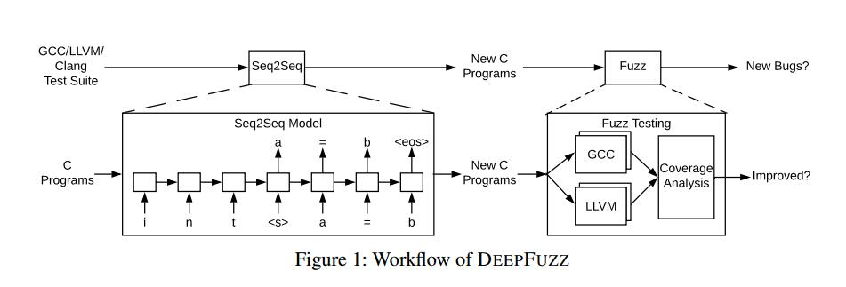
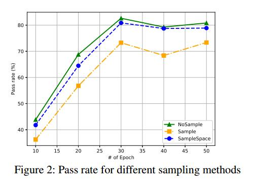
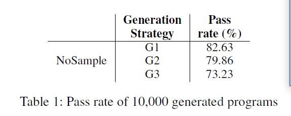
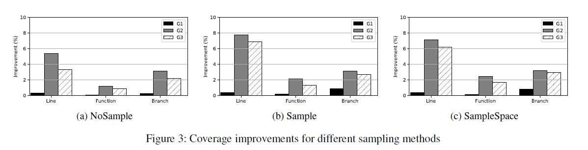
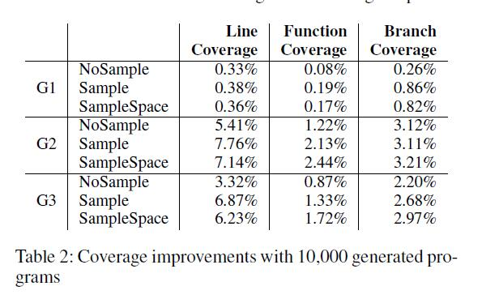
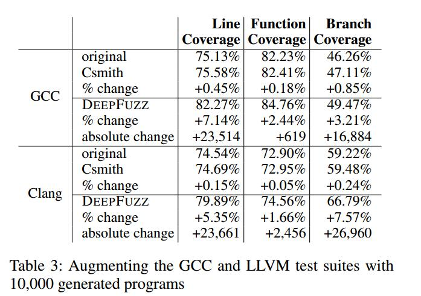
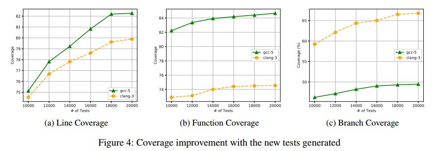

# Abstract

编译器是构建软件最基本的编程工具之一。但是，生产编译器仍然存在问题。模糊测试通常用于新生成或突变输入，以便发现新的错误或安全漏洞。在本文中，我们提出了一种名为DEEPFUZZ的基于语法的模糊测试工具。基于生成的seq2seq模型，DEEPFUZZ自动且连续地生成格式良好的C程序。我们使用这组新的C程序来模糊现成的C编译器，例如GCC和Clang / LLVM。我们提供了一个详细的案例研究来分析生成的C程序的模糊测试的成功率和覆盖率改进。我们用三种采样方法和三种生成策略来分析DEEPFUZZ的性能。因此，DEEPFUZZ在行，函数和分支覆盖方面提高了测试效率。在我们的初步研究中，我们发现并报告了8个GCC漏洞，所有这些漏洞都由开发人员积极处理。

| relevant information |                                                              |
| -------------------- | ------------------------------------------------------------ |
| *作者*               | Xiao Liu, Xiaoting Li, Rupesh Prajapati, Dinghao Wu          |
| *单位*               | College of Information Sciences and Technology<br/>The Pennsylvania State University |
| *出处*               | *AAAI-19*                                                    |
| *原文地址*           | <https://faculty.ist.psu.edu/wu/papers/DeepFuzz.pdf>         |
| *源码地址*           | <https://github.com/wtwofire/deepfuzz>                       |
| *发表时间*           | 2019年                                                       |

# 1. 简介

编译器是最重要的计算系统软件之一，它们通常是信任计算基础的一部分，但它们仍然存在问题。例如，GCC是1987年发布的一款长效软件，是许多类Unix操作系统的标准编译器。自创建以来，已经捕获了超过3,410个内部错误（Yang et al.2011）。同样，对于Java，Python和JavaScript，在那些广泛使用的编译器和解释器中发现了数千个错误。这些编译器错误可能导致意外的程序执行，并导致安全敏感应用程序的灾难性后果。当在应用程序或编译器中无法确定根本原因时，它还可能妨碍开发人员在调试程序时的工作效率。因此，提高编译器的正确性至关重要。但用不断增长的代码库验证编译器并不容易：今天的GCC代码库大约有1500万行代码（Sun et al.2016），接近整个Linux内核，大约有1900万行代码。

使编译器可靠是至关重要的。在过去十年中，编译器验证一直是计算研究中验证授权挑战的一个重要且活跃的领域（Hoare 2003）。主流研究侧重于形式验证（Leroy和Grall 2009），翻译验证（Necula 2000）和随机测试（Lidbury等人2015; Le，Afshari和Su 2014; Le，Sun和Su 2015）。前两个类别尝试提供经过认证的编译器。例如，CompCert（Leroy等人，2016）在这一领域取得了有希望的进展。但实际上，应用形式化技术来完全验证生成编译器（如GCC）是一项挑战，尤其是当证明不是与编译器一起构造时。因此，测试仍然是编译器验证的主要方法。

我们的工作重点是编译器测试。通过向不同的生产编译器提供不同功能的程序，启用不同级别的优化，可以在编译期间触发内部编译器错误（编译器的真正错误），并显示错误消息指示错误的位置和内容。但是，生成“好”程序以提高测试效率并通过自动化此过程构建连续测试框架具有挑战性。在现有方法中，每个测试（包括人工测试）都涵盖了一些功能，现在通常可以看到现代编译器越来越大的测试套件。这提高了测试覆盖率，但构建这些测试需要花费大量人力。然而，荣国模糊测试的实用方法可以减少人力。

Fuzzing（Bird和Munoz 1983）是一种发现漏洞或安全漏洞的方法。程序通过自动生成或修改的输入重复执行，以检测程序崩溃等异常行为。目前使用的输入模糊测试的主要技术是黑盒随机模糊测试（Zalewski 2015），基于白盒约束的模糊测试（Godefroid，Kiezun和Levin 2008），以及基于语法的模糊测试（Dewey，Roesch和Hardekopf 2014）。黑盒子和白盒模糊是完全自动的，并且历史证明在二进制格式文件解析器中找到安全漏洞是有效的。相反，基于语法的模糊测试需要输入语法，该输入语法指定被测应用程序的输入格式，该输入格式通常是手工编写的。这个过程费力，耗时且容易出错。然而，基于语法的模糊测试是当今已知的用于具有复杂结构化输入格式的模糊应用的最有效的模糊测试技术，例如编译器。在编译器测试的场景中，部署基于语法的模糊测试的一种方法是将C语法编码为测试用例生成的规则。但实际上，C11（国际标准化组织（ISO）2011），C编程语言的当前标准，有696页的详细规范，这为工程师构建这样一个基于语法的引擎带来了障碍。
在本文中，我们考虑使用生成递归神经网络自动生成语法有效输入的语法有效输入的问题。更具体地说，我们的目标是训练生成神经网络，以学习输入数据的“语法”，或者更确切地说，语言模式。我们建议在监督学习策略中训练序列到序列模型（Sutskever，Vinyals和Le 2014），利用生产编译器提供的原始测试套件。最初，序列到序列模型广泛用于机器翻译（Klein等人2017）和文本生成（Sutskever，Martens和Hinton 2011）。从理论上讲，通过训练原始段落的模型，我们隐含地将正确的单词拼写，句子的有效语法，写作行为的详细风格编码到生成模型中。同样的想法可以应用于程序综合，其中我们只需要训练模型以在种子数据集之上生成不同的语法上有效的程序。对于训练数据集，我们采用了原始的GCC测试套件，其中有超过10,000个短程序或小程序，涵盖了C11标准中规定的大多数功能。在训练阶段，我们调整参数以将C程序的语言模式编码到模型中，基于此，我们不断生成用于编译器模糊测试的新程序。
贡献。我们的工作是第一个使用生成递归神经网络进行基于语法的编译器模糊测试。

- 首先，拟议的框架是全自动的。通过训练序列到序列模型，可以将其视为训练数据语言模式的隐式表示，在我们的上下文中使用C语法，我们的框架DEEPFUZZ将不断提供新的语法正确的C程序。
- 其次，我们构建了一个用于模糊现成的C编译器的实用工具。我们详细分析了关键因素将如何影响生成模型和模糊性能的准确性。
- •第三，我们应用DEEPFUZZ技术测试GCC和Clang / LLVM。在我们的初步分析期间，测试覆盖范围（线路，功能和分支）增加，我们发现并报告了8个真实的错误。

Fuzzing（Bird和Munoz 1983）是一种发现漏洞或安全漏洞的方法。程序通过自动生成或修改的输入重复执行，以检测程序崩溃等异常行为。目前使用的输入模糊测试的主要技术是黑盒随机模糊测试（Zalewski 2015），基于白盒约束的模糊测试（Godefroid，Kiezun和Levin 2008），以及基于语法的模糊测试（Dewey，Roesch和Hardekopf 2014）。黑盒子和白盒模糊是完全自动的，并且历史证明在二进制格式文件解析器中找到安全漏洞是有效的。相反，基于语法的模糊测试需要输入语法，该输入语法指定被测应用程序的输入格式，该输入格式通常是手工编写的。这个过程费力，耗时且容易出错。然而，基于语法的模糊测试是当今已知的用于具有复杂结构化输入格式的模糊应用的最有效的模糊测试技术，例如编译器。在编译器测试的场景中，部署基于语法的模糊测试的一种方法是将C语法编码为测试用例生成的规则。但实际上，C11（国际标准化组织（ISO）2011），C编程语言的当前标准，有696页的详细规范，这为工程师构建这样一个基于语法的引擎带来了障碍。

在本文中，我们考虑使用生成递归神经网络自动生成语法有效输入用于基于语法的fuzzing。更具体地说，我们的目标是训练生成神经网络，以学习输入数据的“语法”，或者更确切地说，语言模式。我们建议在监督学习策略中训练seq2seq模型（Sutskever，Vinyals和Le 2014），利用生产编译器提供的原始测试套件。最初，seq2seq模型广泛用于机器翻译（Klein等人2017）和文本生成（Sutskever，Martens和Hinton 2011）。从理论上讲，通过训练原始段落的模型，我们隐含地将正确的单词拼写，句子的有效语法，写作行为的详细风格编码到生成模型中。同样的想法可以应用于程序综合，其中我们只需要训练模型以在种子数据集之上生成不同的语法上有效的程序。对于训练数据集，我们采用了原始的GCC测试套件，其中有超过10,000个短程序或小程序，涵盖了C11标准中规定的大多数功能。在训练阶段，我们调整参数以将C程序的语言模式编码到模型中，基于此，我们不断生成用于编译器模糊测试的新程序。

**贡献**。我们的工作是第一个使用生成递归神经网络进行基于语法的编译器模糊测试。

- 首先，拟议的框架是全自动的。通过训练seq2seq模型，可以将其视为训练数据语言模式的隐式表示，在我们的上下文中使用C语法，我们的框架DEEPFUZZ将不断提供新的语法正确的C程序。
- 其次，我们构建了一个用于模糊现成的C编译器的实用工具。我们详细分析了关键因素将如何影响生成模型和模糊性能的准确性。
- 第三，我们应用DEEPFUZZ技术测试GCC和Clang / LLVM。在我们的初步分析期间，测试覆盖范围（行，函数和分支）增加，我们发现并报告了8个真实的错误。

# 2.概述

## 2.1 seq2seq模型

我们在seq2seq模型的基础上构建DEEPFUZZ，该模型实现了两个用于字符级序列预测的递归神经网络（RNN）。 RNN是由隐藏状态h和可选输出y组成的神经网络。它在可变长度序列上运行，x =（x~1~, x~2~……x~T~）。在每个步骤t，更新RNN的隐藏状态h~<t>~
$$
h_{<t>} = f(h_{t−1}, x_t)
$$
其中f是非线性激活函数。 RNN可以学习字符序列上的概率分布以预测下一个符号。因此，在每个时间步t，来自RNN的输出是条件分布p（x~t~ |x~t-1~……x~1~）。例如，在我们的例子中，在下一个字符的多项分布时，我们使用softmax激活函数作为输出
$$
p(x_{t,j} = 1| x_{t−1},……,x_1) = \frac{ exp(w_jh_{<t>})}
{\sum_{j=1}^Kexp(w_jh_{<t>})}
$$
对于所有可能的符号j = 1,……,K ，其中 w~j~ 是权重矩阵W的行。通过组合这些概率，我们计算序列x使用的概率
$$
p(x) =\prod_{t=1}^T
p(x_{t,j} = 1| x_{t−1},……,x_1)
$$
通过学习的分布，通过在每个时间步迭代地采样新字符来生成新序列是直截了当的。

seq2seq模型由两个RNN，编码器和解码器组成。编码器学习将可变长度序列编码为固定长度矢量表示，并且解码器将该固定长度矢量表示解码为可变长度序列。它最初是由Cho等人 （2014）提出的，用于统计机器翻译。编码器RNN读取输入序列x的每个字符，同时RNN的隐藏状态改变。在读取该序列的结束之后，RNN的隐藏状态是整个输入序列的概要c。同时，训练解码器RNN以通过预测给定隐藏状态h~<t>~的下一个字符y~t~来产生输出序列。然而，与纯RNN不同，y~t~和h~<t>~也都以y~t-1~和输入序列的摘要c为条件。在这种情况下，为了计算解码器的隐藏状态，我们有
$$
h_{<t>}= f(h_{<t-1>}, y_{t−1}, c)
$$
同样地，下一个字符的条件分布是
$$
p(y_t|y_{t−1}，……，y_1， c) = g(hti; yt−1; c);
$$
其中 f 和 g 是激活函数。总的来说，两个RNN编码器 - 解码器被联合训练以在给定输入序列的情况下生成目标序列。
所有RNN在循环层中都有反馈循环。

这种设计允许他们随着时间的推移将信息保存在“记忆”中。然而，训练标准RNN以学习长期时间依赖性可能是困难的，但这在程序中是常见的。这是因为损失函数的梯度随时间呈指数衰减（Chung et al.2014）。因此，在我们的设计中，我们采用RNN的变体，长短期记忆（LSTM），特别是在我们的编码器和解码器中。 LSTM单元包括“存储器单元”，其可以将信息长时间保存在存储器中，在这种情况下可以存储长历史信息。

在以前的研究中，seq2seq模型已经过训练，可以生成语法正确的PDF对象来模糊PDF解析器（Godefroid，Peleg和Singh 2017）。这项工作背后的核心思想是，源语言语法可以作为字符串对的训练副产品来学习。 Shi，Padhi和Knight（2016）通过实验研究了seq2seq模型可以学习关于源句的局部和全局句法信息。这项工作为RNN的正式语言合成奠定了基础。在我们的论文中，我们对编译器模糊测试应用了类似的想法。在训练期间，我们将序列分成固定大小为d的多个训练序列。通过剪切序列，我们得到第i个训练序列xi = s [i * d：（i + 1）* d]，其中s [k：l]是索引k和l之间s的子序列。每个训练序列的输出序列是下一个字符，即yt = s [（i + 1）* d + 1]。我们将此训练过程配置为学习一组训练序列的生成模型。

## 2.2 工作流程

一般而言，我们建议DEEPFUZZ用于两个主要目标。第一种是从一组语法正确的程序中生成遵循合法语法的新程序。主要挑战来自长序列处理和语言语法表示。第二个目标是提高编译器测试效率。我们的目标是提高覆盖率并捕获生产编译器中的更多内部错误。



图1显示了DEEPFUZZ的工作流程。整个工作流程分为两个阶段，即程序生成和编译器测试。我们的目标是生产编译器。如GCC，GNU Compiler Collection（2018）和LLVM / Clang（Clang：LLVM 2018的C语言系列前端）。在第一阶段，我们使用来自原始人工编译器测试套件的收集数据训练生成的Sequence-to-Sequence模型。在我们将序列输入训练模型之前，我们对它们进行预处理以避免噪声数据。我们稍后在预处理中详细说明预处理步骤。我们要拟合的模型是一个通用的Sequence-to-Sequence模型，它有2层，每层有512个隐藏单元。我们将模型配置与实验设置中最先进的序列生成研究进行比较。对于程序生成，我们尝试不同的生成策略。我们详细介绍了生成策略及其在生成策略中的基本原理。因为我们的目标是模糊生产编译器，所以我们的目标是生成涵盖C语言最多功能的程序。因此，我们还采用了采样变量中详述的一些采样方法，以使生成的程序多样化。

在第二阶段，我们将生成的C程序（在语法上正确或不正确）提供给不同优化级别的编译器，并记录编译消息。除了编译消息之外，我们还记录执行跟踪以提供覆盖信息。总之，对于此程序生成任务，我们有三个目标：生成语法有效程序，改进代码覆盖率以及检测新错误。我们针对评估中的三个目标，对三个相关指标，合格率，覆盖率和错误进行了研究。

## 2.3 设计

我们提出DEEPFUZZ持续性的为模糊测试生成编译器语法正确的C程序。如概述中所述，完整的工作流程包含两个阶段，即程序生成和编译器测试。在本节中，我们将介绍更多详细信息。

预处理在我们设置训练阶段之前，我们将序列分成多个固定大小的训练序列。每个训练序列的输出序列是输入序列旁边的下一个字符。我们将此训练过程配置为学习所有训练序列集的生成模型。但是，我们注意到连接序列中存在一些需要妥善处理的噪声。在预处理中，我们主要处理三个问题：注释，空格和宏。

- **注释**。我们首先使用训练数据中正则表达式中的模式删除所有注释，包括行注释和块注释。

- **空格**。根据POSIX标准，空白字符包括公共空格，水平制表符，垂直制表符，回车符，换行符和换页符。为了统一程序样式，我们用一个空格替换了所有空白字符。

- **宏**。宏是C编程语言的常见特性。宏是一个代码片段，它已被赋予一个新名称。在我们的实现中，每当使用名称时，它总是被宏的内容替换。

## 2.4 采样变量

我们使用学习的seq2seq模型来生成新的C程序。例如，利用前缀序列“int”，学习的分布很可能预测接下来是“main”。但是，我们的目标是使原始程序多样化，以生成更多生成的语句，如“int foo = 1;”或“int foo = bar（1）;”。因此，我们建议采用一些抽样方法来抽样学习的分布。我们在这里描述了我们用于生成新C程序的三种抽样方法：NoSample，Sample和SampleSpace。

**NoSample**。在这种抽样方法中，我们直接依靠学习的分布来贪婪地预测给定前缀的最佳下一个字符。

**sample**。为了克服NoSample方法的局限性，给定前缀序列，我们建议对下一个字符进行采样，而不是选择顶部预测的字符。

**SampleSpace**。此采样方法是Sample和NoSample的组合。在这种方法中，当前缀序列以空格结束时，我们只对阈值中所有预测值的下一个字符进行采样。

## 2.5 生成策略

为了不断模糊生产编译器，我们使用学习模型生成C编程语言的新序列。我们将原始测试套件中的程序视为种子。基于原始程序中的序列作为前缀，我们将生成新代码。为了充分利用生成的序列，我们提出了三种生成策略：G1）我们将基于相同前缀序列的新生成的代码插入到原始格式良好的程序中; G2）我们生成新的代码片段，但是它们将使用从原始程序中的不同位置随机挑选的前缀序列生成，然后分别插回; G3）我们在原始程序的前缀序列之后删除相同数量的行，并将新生成的新行插入到已被删除的句子的位置。此外，可以在我们的框架内方便地建立更多的生成策略，但我们对这三种进行初步研究。

# 3 评估

## 3.1实验设置

为了评估DEEPFUZZ，我们流程化了一个原型工作流程，该工作流程基于一组语法正确的C程序训练了一个seq2seq模型。最初，收集了包含10,000个格式良好的C程序的训练数据集，并从GCC测试套件中采样。我们训练了具有2层的序列到序列模型，每层有512个LSTM单元。我们将dropout rate 设定为0.2。我们已经发布了源代码。

在先前关于文本生成的研究中（Sutskever，Martens和Hinton 2011），研究人员训练了一个具有超过100 MB训练数据的单层RNN，并且在这个单层模型中有1,500个隐藏单元。对于最接近的相关工作，Learn＆Fuzz（Godefroid，Peleg和Singh 2017）采用生成的序列到序列模型为PDF解析器模糊测试生成新的PDF对象，研究人员训练了一个具有两层的模型，并在每个层中，有128个隐藏单位。他们在包含534个格式良好的PDF文件的数据集上训练了这个模型。在我们的研究中，我们训练了一个两层模型，其中DEEPFUZZ框架的每一层都有512个LSTM单元。训练数据集包含从生产编译器测试套件中采样的10,000个语法正确的C程序，比以前的任何研究都要大。

我们在监督设置中训练了序列到序列模型。为了分析训练表现，我们训练了由通过次数或迭代参数化的多个模型。迭代被定义为学习算法的迭代，以遍历整套训练数据。我们在具有2.90GHz Intel Xeon（R）E5-2690 CPU和128GB内存的服务器机器上训练了50次迭代的模型。我们在五个不同数量的时期保留了模型的快照：10,20,30,40和50。训练一个迭代花了大约30分钟，整个训练阶段花了25个小时。对于新程序生成，如设计中所述，我们使用不同的采样方法和各种生成策略来生成新的C程序。新生成的程序仍然基于原始训练数据;换句话说，我们使用原始的C程序作为种子，我们从中随机选择前缀序列。通过插入新行或用新行替换行到种子中，我们可以获得新程序。由于新生成的部分将引入新的标识符，新的分支，新的功能等，它将使新生成的程序的控制流更复杂，从而提高测试效率。
在我们的研究中，我们使用三个指标来衡量DEEPFUZZ的有效性：

- **通过率**是衡量所有新生成的C程序中语法有效程序的比率的度量。序列到序列模型可能会将C语言模式编码到神经网络中。因此，通过率将是该网络在输入序列上的训练程度的良好指标。我们使用gcc的命令行来解析新生成的程序，如果没有报告错误，则表示该程序的语法正确性。
- **覆盖率**是测试的特定度量。直观地说，测试涵盖的代码越多，我们就越确定测试的完整性。我们在分析过程中收集了三种覆盖信息：行覆盖范围，函数覆盖范围和分支覆盖范围。我们使用gcc支持的命令行工具gcov来收集覆盖信息。
- 错误检测是测试的目标。对于编译器测试，通过向不同优化级别的编译器提供更多程序，预计会触发崩溃或其他代码错误等错误。作为一种自我保护机制，像GCC和Clang / LLVM这样的编译器定义了一种称为“内部编译器错误”的特殊错误。此错误表示编译过程中编译器本身的问题，错误消息将帮助我们找到编译器中的错误。

## 3.2 通过率

通过率是生成的语法有效程序与整个新生成程序集的比率。它是在所提出的序列到序列模型中C语言模式的编码程度的指标。在我们的评估中，具体而言，我们将分析通过率如何随着训练时期的数量，不同的采样方法和不同的生成策略而变化。

**迭代**迭代被定义为学习算法的迭代，以遍历整套训练数据。我们对模型进行了总共50个迭代的训练，我们在不同的时期拍摄了模型的快照：10,20,30,40,50，并将模型应用于新的C程序生成。我们在生成策略G1下尝试了所有三种抽样方法的过程。

结果：图2显示了结果。

- 通过率随着训练的迭代次数从10到30个增加而增加。 30个迭代周期后的合格率下降可能是过度拟合的结果。
- 所有采样方法的最佳通过率均在30个迭代周期的训练中实现。最高合格率为82.63％。
  

**采样**。训练模型后，我们采用了不同的采样方法。正如我们所提出的，采样方法决定了如何根据预测的分布选择新字符，它可以影响合格率。因此，我们根据种子程序在不同的采样方法下记录了新生成的10,000个程序的通过率：NoSample，Sample和SampleSpace。



结果：图2显示了结果。注意，该实验在生成策略G1下进行。

- 对于所有采样方法，通过率在训练的30个迭代周期内增加，之后，有一个小的下降。
- 比较所有三种采样方法的通过率，NoSample为每个快照模型实现了比其他两种方法Sample和SampleSpace更好的通过率。最高合格率为82.63％。

**生成策略**。为了生成新程序，我们引入了三代策略：G1）在一个位置插入两行，G2）在不同位置插入两行，并且G3）替换两条新行。新生成的行基于种子程序中选择的前缀序列。为了分析通过率如何随着不同的生成策略而变化，我们记录了在30个迭代之后使用训练模型执行程序生成的结果。另外，我们在这个实验中使用了NoSample。

结果：表1显示了结果。



- 三个生成策略的合格率分别为82.63％，79.86％和73.23％。比较这三种不同生成策略下的通过率，我们得出结论，在NoSample下，G1在通过率方面表现最佳。

- G1和G2的结果在通过率方面相似，高于G3的通过率。原因可能是，删除行会引入不平衡的语句，例如未闭括号，括号或大括号。

## 3.3 覆盖率

除了通过率之外，如本节开头所述，由于我们正在进行测试，因此覆盖率信息是另一个重要指标。在这一部分中，我们分析了如何通过不同的采样方法和生成策略实现覆盖率改进（行，函数，分支）。

**采样**。为了比较覆盖范围的改进，我们记录了覆盖率信息，包括原始种子测试套件（10,000）覆盖了多少行，函数和分支以及GCC-5和Clang-3新生成的测试套件（10,000） 。此外，为了分析抽样方法如何影响覆盖率的改善，我们记录了不同抽样方法下的覆盖率改善百分比。

结果：覆盖改进信息如表2所示，其中包含来自GEP-5的DEEPFUZZ的10,000个新生成的C程序的增强测试套件，并且比较指标，我们也在图3中显示。





- 在三种不同的采样方法中，Sample在行，函数和分支覆盖改进方面实现了最佳性能。例如，在生成策略G2下，NoSample，Sample和SampleSpace的线覆盖率改善分别为5.41％，7.76％和7.14％。
- 不同采样方法的不同生成策略的覆盖率改善模式相似。G2总是最好的，G1在三者中总是最差的。换句话说，抽样方法的表现与生成策略略有关联。

**生成策略**。除了抽样方法，我们还对如何在不同的生成策略下改进这三种不同的覆盖范围感兴趣。

结果：图3显示了使用G1，G2和G3如何改善覆盖范围。

- 比较三种不同发电策略下的覆盖范围改进，G2，即在不同位置插入两条新线路，在大多数情况下，在行，函数和分支覆盖范围改进方面实现了最佳性能。
- 与采样方法相比，采用生成策略是提高覆盖率的一个更有影响力的因素。例如，在SampleSpace下，三种生成策略的函数覆盖率改善百分比分别为0.17％，2.44％和1.72％。从G1变为G2后，覆盖率提高了42倍。
-  G2和G3在覆盖率改善方面表现相似，远高于G1。

**总体**。为了演示我们的工具如何在编译器模糊测试中执行，我们将DEEPFUZZ与用于编译器测试的精心设计的实用工具进行了比较。 Csmith（Yang et al.2011）是一个可以生成随机C程序的工具。为了进行公平的比较，我们记录了Csmith和DEEPFUZZ的覆盖范围改进，通过增加GCC和LLVM测试套件以及表3中的10,000个生成程序。

请注意，我们在进行此分析时使用Sample作为采样方法，使用G2作为我们的生成策略。我们还记录了图4中程序生成过程中的覆盖率改进。它演示了随着新测试数量的增加，行，函数和分支覆盖范围如何得到改善。



结果：

- 对于所有案例，Csmith将覆盖率提高了不到1％，而DEEPFUZZ分别将行，函数和分支的覆盖率提高了7.14％，2.44％和3.21％。 DEEPFUZZ实现了比Csmith更好的覆盖率改善。
- DEEPFUZZ的覆盖率改善模式的性能与GCC-5和Clang-3相似。



## 3.4新错误

使用不同的生成策略和抽样方法，基于GCC测试套件中的种子程序，我们可以生成新程序。因为我们的目标是编译器模糊，所以检测到的错误数量是DEEPFUZZ功效的重要指标。在我们的初步研究中，我们发现了8个新确认的GCC错误，我们将详细说明我们检测到的两个错误。

**GCC错误84290**：这是我们报告的错误。 DEEP FUZZ生成两个新行（第5行和第6行），它们触发内置函数原子载荷n的内部编译器错误。触发错误是因为此函数的第一个参数应该是指针，但它指向不完整的类型。此错误已修复，并且新测试（atomic-pr81231.c）已添加到GCC中的最新测试套件中。  这个检测到的错误显示了使用语法良好但语义无意义的测试进行编译器测试的重要性。

```c
double f () {
	double r;
	asm ("mov %S1,%S0; mov %R1,%R0" : "=r" (r) : "i" (20));
	asm ("mov %S1,%S0; mov %R1,%R0" : "+r" (r) : "i" (20.));
	atomic load n ((enum E ∗) 0, 0);
	;
	return r;
}
```

**GCC Bug 85443**：这是我们报告的错误。 DEEPFUZZ生成两条新行（第5行和第6行），引入了新的崩溃。生成的Atomic是用于定义原子类型的关键字，第6行的赋值触发了分段错误。这是GCC-5上新确认的错误，已在最新版本中修复。这个由DEEPFUZZ检测到的错误再次显示了使用语法上格式良好但语义无意义的测试进行编译器测试的重要性。

```c
char acDummy[0xf0] attribute (( BELOW100 ));
unsigned short B100 attribute (( BELOW100 ));
unsigned short ∗p = &B100;
unsigned short wData = 0x1234;
Atomic int i = 3;
int a1 = sizeof (i + 1);
void Do (void) f
B100 = wData;
g
int main (void) f
∗p = 0x9876;
Do ();
return (∗p == 0x1234) ? 0 : 1;
g
```

# 4 限制

观察生成的程序，我们注意到许多不正常的生成是由预期的表达式引起的。更具体地说，此错误消息表示错误，如不平衡的括号，括号或大括号。我们总结了导致这一问题的两个主要原因：缺乏训练和全局信息丢失。

由于第一个原因，训练数据很丰富，但在当前训练数据集中仍然缺乏足够的重复模式来训练良好的生成模型。在我们未来的工作中，我们可以通过枚举原始测试套件中具有新变量或函数名称的所有结构来创建更大的训练数据集。另一方面，因为生成基于前缀序列，所以它将丢失一些超出前缀序列范围的全局信息。为了解决这个问题，我们要么增加训练序列的长度以确保捕获足够的信息，要么我们可以使用一些启发式方法来帮助进行模型训练。前一种方法可能导致生成的程序中的多样性较少，后一种方法需要静态程序分析的帮助。

另外，我们提出的方法基于字符级序列到序列模型。我们为当前模型提供了一系列字符，这需要在处理令牌级语法时付出很多努力。它也会损害培训的可扩展性和通过率。在C中，少于32个关键字和100多个内置函数。如果我们通过Sequenceto-Sequence模型执行令牌级序列预测，则通过率和可伸缩性都将增加。

# 5 相关工作

多年来，人们广泛讨论了基于AI的软件安全和软件分析应用程序（Zamir，Stern和Kalech 2014; Elmishali，Stern和Kalech 2016; Nath和Domingos 2016）。基于神经网络的模型在各种应用中占主导地位，并且使用它们进行程序分析（Allamanis和Sutton 2013; Nguyen等人2013）和合成（Lin等人2017; Devlin等人2017年）的兴趣大幅增长。 ）。循环神经网络，尤其是基于序列到序列的模型，已经开发用于从大型代码语料库中学习源代码的语言模型，然后将这些模型用于多种应用，例如学习自然编码约定，代码建议，自动完成和修复语法错误（ Bhatia和Singh 2016; Hindle等人，2012）。事实证明，在提供大量数据时，提高系统效率以及节省人力是有效的。此外，基于RNN的模型适用于基于语法的模糊测试（Godefroid，Peleg和Singh 2017; Cummins等。2018）学习生成模型以生成PDF文件以模糊PDF解析器。

# 6 结论和未来工作

编译器测试对于确保计算系统的正确性至关重要。在本文中，我们提出了一种基于语法的自动模糊测试工具，称为DEEPFUZZ，它学习生成的递归神经网络，不断生成语法正确的C程序，以模糊现成的生产编译器。 DEEPFUZZ生成了82.63％语法有效的C程序，并提高了行，函数和分支覆盖的测试效率。我们还发现了开发人员正在积极解决的新漏洞。


