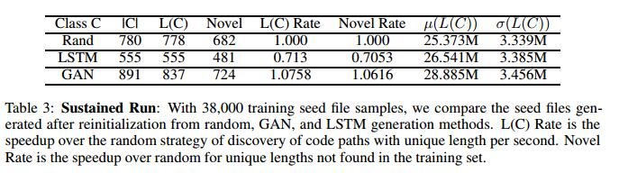

# Abstract

我们通过使用生成对抗网络（GAN）模型来改进美国模糊Lop（AFL）模糊测试框架的性能，以使用新的种子文件重新初始化他的系统。我们根据生成新颖和看不见的代码路径的时间速率来评估性能。我们将此方法与在训练种子文件中观察到的随机抽取字节的种子文件生成进行比较。代码路径长度和变化不够多，无法完全取代AFL输入生成。但是，使用这些额外的代码路径扩充原始AFL表明比原AFL有所改进。具体而言，实验表明，GAN比LSTM更快，更有效，并且优于随机增强策略，通过发现的唯一代码路径的数量来衡量。 GAN帮助AFL在相同的CPU时间内发现比随机策略多14.23％的代码路径，找到6.16％的唯一代码路径，并找到平均13.84％的路径。使用GAN有望成为AFL的重新初始化策略，以帮助模糊测试人员在软件中运行深入的路径。

| relevant information |                                                              |
| -------------------- | ------------------------------------------------------------ |
| *作者*               | Nicole Nichols, Mark Raugas, Robert Jasper, Nathan Hilliard  |
| *单位*               | nicole.nichols@pnnl.gov mark.raugas@pnnl.gov
robert.jasper@pnnl.gov
nathan.hilliard@pnnl.gov |
| *出处*               | arxiv                                                        |
| *原文地址*           | <https://arxiv.org/abs/1711.02807>                           |
| *源码地址*           |                                                              |
| *发表时间*           | 2017                                                         |

# 1. 简介

通过测试识别软件缺陷是一个具有挑战性的问题。多年来，已经开发了许多方法来测试软件，包括随机变异测试（黑盒模糊测试）Doupéu.a （2012），Woo.u.a（2013），抽象解释（来通过源源代码或机器代码）Cousot和Cousot（1977），Cadar.u.a （2008），Ma.u.a （2011年），和基于性能的测试Arts.u.a （2006年）,Claessen und Hughes（2011年）。

符号执行等方法提高了程序的分析保真度Schwartz.u.a （2010年）。 Z3，Boolector等可满足性模数理论（SMT）求解器的开发使得对软件的推理进行了强有力的程序化分析，De MouraundBjørner（2008） Brummayer und Biere（2009）。分离逻辑允许将分析应用于复杂的数据结构Reynolds（2002）; Dongol.u.a（2015年）。

American Fuzzy Lop（AFL）是一种先进的模糊测试框架，用于发现许多新颖的软件漏洞（https://github.com/mrash/afl-cve）。 AFL使用字节串的随机变换来识别唯一的代码路径并发现目标程序中的缺陷。然后，成功生成唯一代码路径的输入被记录为“种子文件”。我们建议使用这些原生种子文件作为深度生成模型的训练数据，以创建增强的种子文件。我们提出的重新初始化方法是一个可扩展的过程，可以缩短发现软件缺陷的时间。

其他研究人员使用机器学习来增强模糊测试框架，包括：Godefroid .u.a （2017），wang.u.a （2017年）。为了识别更深层次的错误和代码路径，Steelix Li.u.a（2017）使用基于程序状态的二进制模糊方法和Driller Stephens .u.a（2016）演示了使用模糊测试和选择性执行的混合方法。 AFLFASTBöhme.u.a（2016）使用马尔可夫链模型扩展AFL。深度神经网络（DNNs）Bengio.u.a（2015），在自然语言处理（NLP）Jones（2014）领域取得了巨大成功；Wu.u,a （2016）计算机视觉Krizhevsky.u.a（2012年），以及像Go Mnih.u.a（2013）这样的有界游戏，或像ATARI Silver.u.a （2016）等视频游戏。。这些DNN可以帮助现有的程序分析工具更好地运行吗？在我们的工作中，我们调查了这个问题，我们使用Generative Adversarial Networks（GAN）Goodfellow.u.a（2014）和长期短期记忆（LSTM）Sak.u.a （2014）增加其唯一代码路径发现率从而来增强AFL Zalewski，一个先进的模糊测试框架。

我们的工作量化了生成模型等增强策略可以提供的好处，即使受到少量培训数据的限制。通过在探索输入空间时周期性地干扰AFL的状态，我们能够改善其性能，如通过唯一代码路径所测量的。具体来说，我们测试了我们围绕以太坊木业（2014）项目的软件生态系统的方法。作为一个金融系统，以太坊代码库的正确性对于保证事务或计算无故障运行非常重要。我们选择Ethkey作为最初的模糊测试目标。Ethkey是一个小型C ++程序，作为cpp-ethereum项目的一部分提供，用于对以太坊钱包进行加载，解析和执行维护，更重要的是，它采用简单的输入文件，使用AFL进行测试变得容易。

# 2 实验设计

首先，我们描述AFL的基本功能，突出显示与建议的增强框架相关的关键功能。接下来，我们将介绍用于创建LSTM和GAN生成的种子文件的方法。作为基线，我们还考虑从用于构建LSTM和GAN模型的训练数据中随机生成种子文件。 AFL扩展了GCC编译器，它与遗传算法结合使用，用于创建种子文件。每个种子文件记录产生唯一代码路径的输入，发现时间，并用作生成未来种子文件的变异（或模糊测试）的基础。我们的扩充策略利用了这样一个事实：如果外部工具在AFL工作目录中放置其他种子文件，AFL将在后续模糊测试运行中将这些文件用作输入。

为了生成我们方法的训练数据，我们在目标程序P上运行AFL一段固定的时间。对于通过P获取的每个唯一执行轨迹τ，AFL生成初始种子文件集S = {S0，...，SK}。我们使用S作为LSTM和GAN模型的训练样例，这些模型都使用Keras Chollet（2017）进行训练。

我们的LSTM通过将AFL生成的种子文件语料库S连接到单个文件中进行训练，并生成最大长度为40个字符的新种子文件。 LSTM模型具有128宽的初始层，内部隐藏层和最终的softmax激活层。为了训练LSTM模型，我们使用RMS传播作为我们的优化器和分类交叉熵损失函数。该模型接收从训练语料库中采样的种子序列，并预测序列中的下一个字符。我们另外调整单独的温度参数以使从网络中的输出种子文件多样化。生成的种子文件记为SL。

在我们的GAN架构中，构建了两个模型，一个生成器G，它与鉴别器D进行对比。G被优化以生成真实的输出，鉴别器D的任务是预测数据是真还是假。这种训练策略是无人监督的，特别富有表现力。生成模型G是完全连接的2层DNN，具有ReLU非线性作为内部激活和tanh输出激活。它通过随机梯度下降训练二元交叉熵损失函数。辨别模型D是3层DNN，但是第一层具有25％的丢失，接着是两个完全连接的层。它使用Adam优化器进行随机梯度下降，并将GAN过程产生的种子文件记为SG。

另外，给定原始AFL种子文件S，我们从该训练集中随机抽取字节并产生与SG相同长度的新的随机种子文件SR。这作为基线来确定基于GAN和LSTM的种子生成的增加的时间和复杂性是否真正提供了优于随机扰动AFL状态的简单策略的优势。

**小实验**：仅种子文件（SR，SG和SL）不是最终目标。但是，我们感兴趣的是描述它们的可变性和其他属性，因为它们将在AFL重新启动时提供一组初始条件。在单个CPU内核的模糊运行中，我们生成936个用于训练初始GAN和LSTM模型的唯一代码路径。通过从/ dev / urandom绘制随机字节来执行随机种子生成。对于每种方法，我们生成200个样本，在单个CPU上重新初始化AFL，仅使用一种方法的种子文件，再运行72小时以测量对代码路径发现的影响。 LSTM和GAN模型都非常出色地进行AFL重新初始化的随机抽样。我们总结了在表1中发现新代码路径的平均时间。

每个种子文件在作为ethkey的输入提供时会生成程序跟踪。具有不同长度的代码路径将在至少一个基本块或分支指令中不同。唯一的代码路径长度可以快速计算，但只能在使用AFL的模糊运行中提供测试框架所执行的唯一代码路径数量的下限。具有相同长度的两个代码路径可以由唯一跟踪产生，因此需要详细评估以确定来自种子文件执行的代码路径的真实唯一性。

**大型实验**：为了演示此扩充策略的可扩展性，我们在200个CPU内核上执行了延长的AFL运行72小时。 AFL运行中的每个核心在前10到12个小时的模糊测试后停止查找种子文件，并在49个工作日中累积了39,185个种子文件。由于AFL的内部簿记机制，已知在给定节点内生成的所有种子文件都是唯一的。但是，内容在节点之间不同的种子文件原则上可以使用相同的代码路径。通过测量每个程序跟踪（代码路径）的长度，我们可以计算仅通过计算具有唯一长度的路径而发现的唯一路径数的下限。在从节点之间移除相同的种子文件并且导致导致相同代码路径长度的种子文件之后，我们估计初始文件的802与独立工作者节点重复。删除这些重复项会导致总共38,384个唯一文件。
然后，我们在唯一种子文件的总语料库上训练GAN和LSTM网络，并分别从每种方法生成大约20,000个样本，以用作合成种子文件以重新初始化AFL。 GAN花了大约30分钟来训练和生成合成种子文件，而LSTM需要14个小时才能完成。

在表2中，我们总结了与来自原始AFL的种子文件和来自该较大实验的合成生成方法相关联的程序轨迹（即，代码路径）的长度的均值和方差。与AFL相比，合成种子文件作为被测程序的输入提供时，不会导致探索深层路径。因此，我们不能简单地用生成模型取代AFL。相反，我们寻求将生成模型与AFL结合起来以提高其性能。我们从这些数据中看到，实际上，LSTM和GAN生成的种子文件在生成的代码路径的均值和方差方面不能代表分布S.这强化了使用SG和SL作为增强策略而不是直接替代AFL种子的需要。

接下来，我们使用来自初始种子文件的随机字节采样（即，不对种子文件进行学习）对GAN，LSTM和随机重新初始化策略进行24小时模糊测试。表3总结了我们的结果。所有这三种策略都允许生成其他种子文件。基于GAN的方法产生的种子文件比随机方法快14.23％，比使用LSTM快60.72％。我们确实失去了30分钟的GAN训练时间，否则可以使用随机抽样方法进行模糊测试;按这段时间折扣会使代码路径速率降低11.85％。但是，我们对唯一的代码路径最感兴趣。 GAN发现了最多的种子文件，其相关的代码路径在初始模糊测试中没有找到长度，优于随机控制方法6.16％。
GAN发现的平均代码路径长度比随机控制长13.84％，因此GAN能够在程序中执行更深的路径。 LSTM模型的表现落后于GAN和随机抽样，并且花费了相当长的时间（14小时）进行训练。

# 3 结论

在这项工作中，我们探索了使用深度神经模型增强随机变异测试的效用。原始AFL通过使用编译器插件将来自遗传算法的文件变异策略与程序设备相结合。当我们使用从GAN模型构建的新种子文件重新开始中间模糊运行时，我们观察到AFL性能的最大改进。尽管合成种子文件统计平均具有相似的路径长度，但是当重新启动模糊测试系统时，GAN从随机或LSTM策略中执行重新初始化。 LSTM模型在训练时间和代码路径发现时间方面都存在缺陷。这两种方法都没有使用手动分析或有关被测程序的文件格式的信息。 GAN和随机策略都改善了AFL的性能，即使程序的内部状态永远不会直接暴露。

未来的工作包括对其他目标的实验，包括DARPA网络大挑战问题，开源OS网络服务，字节码解释器以及其他容易生成输入数据的系统应用程序和程序。我们还计划探索暴露被测试程序的内部状态，以便为强化学习定义奖励功能。我们设想这种内部状态可以通过以下方式公开：1）插桩AFL通过其GCC编译器插件添加到程序中，2）使用英特尔的PIN工具输出每个代码路径的长度或关于给定迹线的摘要信息3）记录程序跟踪使用诸如Mozilla的rr工具之类的重放框架来收集其他描述性统计信息。

