# Abstract

本文旨在设计和实现文件格式模糊器。文件是大多数实际应用程序的重要输入。将输入文件生成为测试数据的实质难点在于重新调整文件的基础结构和格式。为了区分存储在文件中的纯数据和描述文件格式的元数据，本文提出了一种基于神经语言模型的深度学习方法。得到的学习模型可以作为混合测试数据生成器应用，以生成和模糊输入文件的文本和非文本部分。此外，该模型可以应用于生成测试数据以模糊元数据和存储在文件中的普通数据。我们使用两个已知的模糊测试工具AFL和Learn＆Fuzz进行的实验证明了我们提出的方法的代码覆盖率相对较高。实验还表明，简单的神经语言模型提供了比复杂的编码器 - 解码器模型更准确的学习模型。

| relevant information |                                                          |
| -------------------- | -------------------------------------------------------- |
| *作者*               | Morteza Zakeri Nasrabadi, Saeed Parsa, Akram Kalaee      |
| *单位*               | Iran University of Science and Technology, Tehran, Iran. |
| *出处*               | arXiv                                                    |
| *原文地址*           | <https://arxiv.org/abs/1812.09961>                       |
| *源码地址*           | <https://github.com/m-zakeri/iust_deep_fuzz>             |
| *发表时间*           | 2018                                                     |

# 1. 简介

Fuzzing [1,2,3,4]是一种动态软件测试技术，用于检测程序中的故障和漏洞。为此目的，只要程序崩溃，或者观察到意外行为，就会生成测试数据集并将其注入到被测软件（SUT）中。在软件处理格式错误和不受信任的文件（包括Web浏览器，便携式文档格式（PDF）阅读器和多媒体播放器[5,6]）的情况下，文件格式模糊测试具有重要意义。

与文件格式模糊器有关的主要挑战是将测试数据生成为文件，覆盖SUT的执行路径。要为处理文件程序作为主要输入的模糊测试生成测试数据，模糊器需要知道文件格式。事实上，在没有文件格式的先验知识的情况下，大多数生成的测试数据可能在运行SUT后很快被拒绝，这可能导致代码覆盖率低[7]。手动提取文件格式是解决此问题的常用解决方案。然而，这种解决方案昂贵且耗时，并且总是需要可能不可用的文件格式规范。因此，文件格式的自动检测一直是测试数据生成方法的重点[8,9]。

与文件格式的自动检测有关的主要困境是区分用于定义格式的元数据（例如用于定义格式的标签和参数）与存储在文件中的纯数据。除了格式良好的测试数据外，还要对程序进行模糊处理，还需要格式错误的数据。畸形数据应保存在输入文件中的适当位置，以便揭示相应SUT的缺陷[9]。

通常，诸如MuPDF [10]之类的程序在解析和渲染的两个不同阶段处理给定的PDF文件[11] [12,7]。解析器检查格式，同时将检查的格式复制到主存储器中的某些数据结构中。在呈现阶段，处理加载的数据。例如，向用户显示文件的内容。因此，观察到文件格式模糊器应该在解析和呈现阶段模糊SUT。因此，模糊器应该能够区分数据和保存在文件中的元数据以确定其格式。

实现相对较高的代码覆盖率存在巨大挑战。例如，AFL [13]是一种众所周知的基于变异的文件格式模糊器，它采用进化方法，旨在生成具有最大代码覆盖率的测试数据。 AFL改变随机选择的文件群以实现文件，覆盖尚未观察到的新路径。
然而，据观察，对于大量执行路径，AFL在合理的时间内不能满足可接受的代码覆盖率，并且它不适合具有复杂输入结构的模糊程序[14]。一种有前景的方法是使用学习技术来模糊测试数据生成。为此，Learn＆Fuzz [8]作为基于生成的文件格式模糊器，采用seq2seq[15,16]方法，以将输入文件的结构学习为生成模型。然后使用生成模型生成文件作为输入测试数据。

最初，seq2seq旨在映射不同域的两个序列[15]。但是，学习文件的结构不是映射问题，可以使用更简单的模型来完成。在Learn＆Fuzz [8]中，只学习文本数据，而复杂的文件格式包含文本和非文本数据。此外，在Learn＆Fuzz中，生成数据始终以固定前缀obj开头，导致测试数据种类繁多，最后，所提出的模糊算法（称为SampleFuzz [8]）可能不会在所有执行中终止。

在本文中，为了缓解上述挑战，我们提出了一种新的测试数据生成方法，应用于文件格式的模糊器。我们的方法通过使用基于深度递归神经网络（RNN）的神经语言模型（NLM）而不是seq2seq模型来学习复杂输入文件的结构。引入了两个新的模糊算法来模糊输入文件的文本和二进制部分，每个部分都针对文件执行过程的一个阶段。我们还设计并实现了IUST DeepFuzz，这是一种新的模块化文件格式模糊器，可进行模糊测试。 IUST DeepFuzz可以学习任何复杂的文件格式并全自动生成新的测试数据。总之，我们的主要贡献如下：

- 我们引入了混合测试数据生成方法，利用基于突变和基于生成的方案。 
- 我们设计并实现了一种新的文件格式模糊器IUST DeepFuzz。
- 我们提供了一个新的数据集，IUST PDF Corpus，用于训练和测试描述PDF文件格式的模型。
- 我们应用NLM来学习具有长依赖性的复杂文件格式的结构。

通过学习PDF文件格式[11]来评估所提出的方法，然后使用结果格式生成PDF文件作为测试数据来模糊开源PDF查看器MuPDF [10]。我们的评估结果表明，相比较先进的文件格式模糊器，代码覆盖率相对较高[8,13]。此外，在本文中，我们表明NLM优于学习和模糊序列，以及关于学习文件格式准确性的序列模型。

本文的其余部分安排如下。在第2节中，我们简要介绍语言模型（LM）和RNN作为我们提出的方法中使用的基本概念。在第3节中，我们描述了我们提出的用于学习文件结构，生成和模糊新测试数据的方法。第4节涉及各种实验和评估，通过将我们的方法与现有方法进行比较而提供。相关的工作在第5节中讨论。最后，在第6节中，我们总结了我们提出的方法，并讨论了一些关于模糊测试的未来工作。

# 2.语言模型和递归神经网络

我们已经应用语言模型来学习文件的结构作为符号序列。语言模型是NLP中的基本概念，它允许预测序列中的下一个符号[17]。更确切地说，LM是在一系列单词/符号上的概率分布，其识别给定序列的概率。通过使用LM，我们可以在一些现有的序列中选择更可能的序列。序列的LM为x = <x^（1）^…… x^（n）^>定义如下[18]：

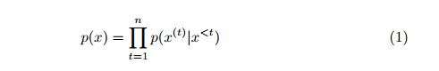

在等式1中，每个单独的项p（x^（t）^| x ^<t^）指示给定先前符号x ^<t^的当前符号x^（t）^的条件概率，也称为上下文。在实践中，以等式1的形式计算该概率几乎是不可能的，因为我们需要查看所有可能的序列。为了克服计算挑战，传统的n-gram LM仅考虑基于某种马尔可夫假设的n-1个单词的固定上下文窗口。虽然很有希望，但在许多情况下，这些模型不适用于长序列（超过4或5个符号）或看不见的序列[18]。

为了解决n-gram问题，可以使用一系列深度神经网络，即用于构建LM的递归神经网络，这被称为神经语言模型[19]。 NLM可以扩展到更长的上下文而不会遇到零概率问题。 RNN用于处理顺序数据。它以一系列时间步长处理输入序列，并更新其内存以产生隐藏状态h（i）。图1显示了一个带有一个隐藏层的简单RNN。在每个时间步t中，处理输入序列的一个矢量。 RNN的前馈方程定义为方程2至5 [20]：

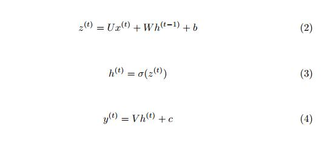

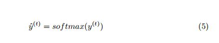

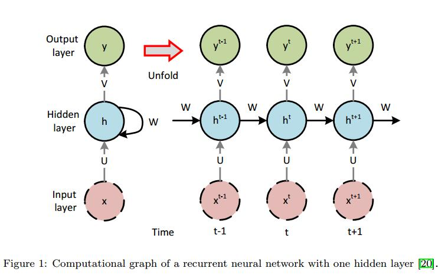

其中b和c是偏置矢量，矩阵U，V和W分别是在网络训练期间学习的输入 - 隐藏，隐藏 - 输出和隐藏 - 隐藏连接的权重。通过定义损失（目标）函数并使用优化方法来最小化它来实现学习。 σ是一种激活函数，如sigmoid。 softmax函数应用于输出层，以将网络输出转换为有效的概率分布。

LM作为生成模型，在一系列符号上提供概率分布。通过从这样的分布中采样，可以生成新的序列。在我们提出的方法中，每个文件都被视为一个字节序列，从文件的语言派生而来。然后，我们将为每种文件格式构建相应的语言模型。

# 3.神经模糊测试

我们提出的测试数据生成方法包括三个主要步骤。首先，收集一些样本数据，即输入文件，并对它们进行预处理。其次，在提供的训练集上训练语言模型。第三，通过学习模型生成和模糊测试数据。生成测试数据后，我们就可以对任何给定目标进行模糊测试。图2显示了我们提出的方法的流程图，将在以下部分中进行更详细的讨论。

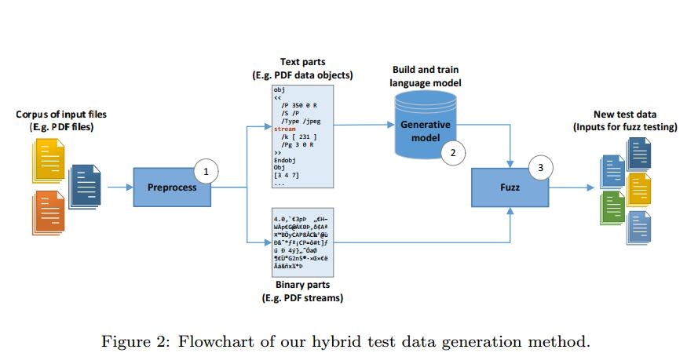

## 3.1.概述

如图2所示，在开始时（步骤1），我们以我们想要学习的格式收集大量样本文件，例如HTML或PDF文件。然后，每个样本文件中的二进制（非ASCII）部分被替换为唯一令牌，称为二进制令牌（BT）。例如，我们用令牌流替换PDF文件中的所有流。通过使用这种简单的策略，我们可以仅使用一组ASCII序列训练LM。这样的模型可能在生成阶段预测BT，因此我们可以用突变的二进制部分替换BT，其先前由基于突变的方法生成。当然，我们需要保留原始二进制元素以用于未来的突变和替换。这样，与忽略二进制部分[8]的当前方法不同，我们可以同时生成测试数据的二进制和文本部分。

在预处理阶段，我们还在每个文件的末尾添加一个结束标记（ET），指示已处理文件的完整性。然后，我们将所有文件连接在一起并构建大量文件。该序列用于训练LM，但在训练之前，我们将其分为三个独立的集合，如训练集，测试集和验证集。需要这样的划分来测量对看不见的数据的模型准确性和困惑度。它也有助于我们生成新数据（参见第3.3节）。某些文件格式明确具有ET。例如，HTML文件以令牌</ html>结束。在这种情况下，不需要添加额外的令牌。现在，我们可以定义我们的模型并在提供的数据集上训练它们（步骤2）。

最后，我们的两个新引入的模糊算法用于生成和模糊新的测试数据，称为DataNeuralFuzz和MetadataNeuralFuzz（步骤3）。前者用于模糊测试数据中的数据，后者用于模糊文件的格式。

为了研究模型复杂性在学习文件结构中的作用以及使用结果结构生成测试数据，我们构建了四个具有不同超参数的模型和基于RNN的体系结构，如表1所示。乍一看，它似乎模型越复杂，描述所需文件格式的语言模型就越准确。但是，我们的实验表明，情况并非总是如此。我们使用不同复杂性模型得到的语言模型应用实验表明，相比之下，更简单的模型导致语言模型可以达到相对较高的代码覆盖率。

表1中列出的每个模型使用长短期记忆（LSTM）单元[21]作为可以学习长序列输入的RNN单元。前三个模型是单向多对一LSTM [22]，其架构类似于图1.这些模型是不同的w.r.t.每个图层中隐藏图层和单位的大小会影响每个模型的训练参数数量。最后一个模型（模型4）是双向LSTM。双向LSTM以后向和前向顺序访问输入序列。双向LSTM由两个单向LSTM组成。其中一个处理输入序列从左到右，另一个从右到左处理。结果，每个前向传递具有两个输出。需要合并功能来组合这些输出并生成单个输出。我们选择使用sum函数，它按元素添加两个输出向量。

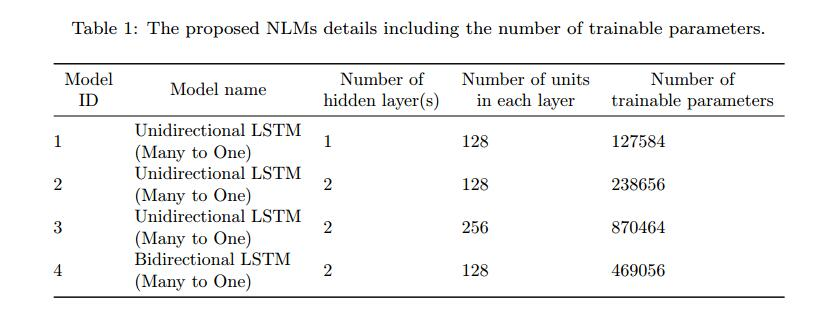

## 3.2.训练模型

表1中显示的所有模型的训练过程是相同的。神经网络以监督模式进行训练;也就是说，网络的每个输入都需要输出标签。为了训练每个模型，我们需要指定相应的深度神经网络的输入和输出。我们将训练集序列S分成具有固定长度d的多个较小子序列，使得第i个子序列xi将是：

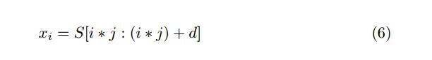

其中S [l：u]是索引l和u之间S的子序列，j是跳跃步骤，表示从原始序列S中选择下一个子序列的前向跳转; xi是模型的输入序列。每个输入序列xi的相应输出或换句话说标签定义为：

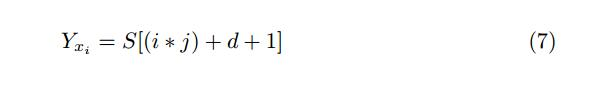

实际上，输出是输入序列的下一个符号。在生成所有输入序列及其相应的输出符号之后，可以训练模型。在训练期间，模型学习条件概率p(x^(i+d+1)^ | < x^(i)^，……， x^(i+d)^ >) 这将最终使它能够预测给定子序列xi的下一个符号x^（i+d+1）^的出现。

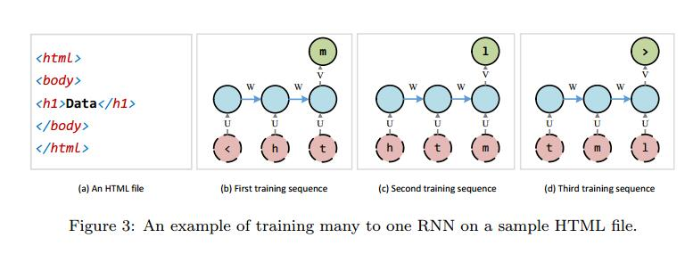

图3显示了上述示例HTML文件的训练方法的示例。前三个训练序列及其对网络的呈现如图所示。参数d和j分别设置为3和1。在实践中，d可以设置为大数，即40或甚至100，这使得可以学习长依赖性。

## 3.3.生成新的测试数据

训练过程完成后，我们可以使用学习的模型生成新数据。为此，我们首先从测试集序列中随机选择长度为d的前缀P，并将其提供给模型。该模型将下一个符号的预测作为所有符号的有效分布。然后，选择符号形式的该分布，并将其扩展到P的末尾。接下来，去除P的第一个符号，而P的长度为d。现在，我们使用更新的前缀查询模型并生成下一个符号。此过程将继续，直到生成结束令牌ET。

从输出分布中选择一个符号有很多策略。
一个简单的策略是贪婪地选择具有最高概率的符号。这样的策略导致格式良好的文件。但是，生成的测试数据总是限于前缀的数量，即测试集的大小。另一种常见策略是将预测分布作为多项分布进行采样。采样可以产生各种测试数据，但并不能保证它们都是格式良好的。因此，我们需要一种机制来控制采样期间生成的测试数据的多样性。

在[8]中，作者引入了SampleSpace，它结合了贪婪选择和采样，但该方法有点复杂，并不是生成新测试数据的明确方法。他们的纯采样策略产生了更好的结果。我们在采样策略中引入了超参数，多样性。分集D是区间（0， 1）中的实数。在生成阶段，模型预测值除以分集，D。应用softmax函数后，进行抽样。结果，较低多样性导致采样策略关闭贪婪策略并产生较少的各种但格式良好的测试数据。另一方面，更高的多样性使得采样策略远离贪婪策略并创建更多种不同但形成错误的测试数据。

## 3.4.模糊测试数据

当我们使用表1中的模型和上一节中概述的采样策略生成测试数据时，生成的数据将存在固有的变化，因此这些数据可用作测试数据。然而，学习文件结构和模糊它是光谱的两端。学习希望捕获格式良好的文件的结构，并生成可以通过文件解析器的文件，而模糊测试打算破坏文件结构，希望使程序执行失败。在本节中，我们介绍了神经模糊算法，目的是在前两个目标和文件格式模糊测试的最终生成测试数据之间建立权衡。我们的算法扩展和改进了SampleFuzz算法[8]。正如我们所提到的，文件由数据和元数据的两部分组成，每个部分都在一个单独的阶段中处理。我们引入了两个名为DataNeuralFuzz的算法，用于模糊数据，针对渲染阶段，MetadataNeuralFuzz用于模糊元数据，针对解析阶段。

DataNeuralFuzz显示在算法1中，MetadataNeuralFuzz显示在算法2中。两种算法都将学习模型M，序列前缀P，分集D，模糊率FR，结束标记ET，二进制标记BT作为输入，并作为输出返回测试数据T D.每个算法都有一个主循环，一直持续到没有生成ET。在while循环内，M用D采样。然后在算法中不同的某些条件下修改（模糊）预测符号。退出while循环后，算法检查T D是否包含BT。如果它包括BT，则BT被实际二进制部分替换，该实际二进制部分在基于突变的方法中被模糊化，例如随机地。请记住，在将二进制部件与原始数据集分离时，我们已经存储了它们。最后，算法返回T D.

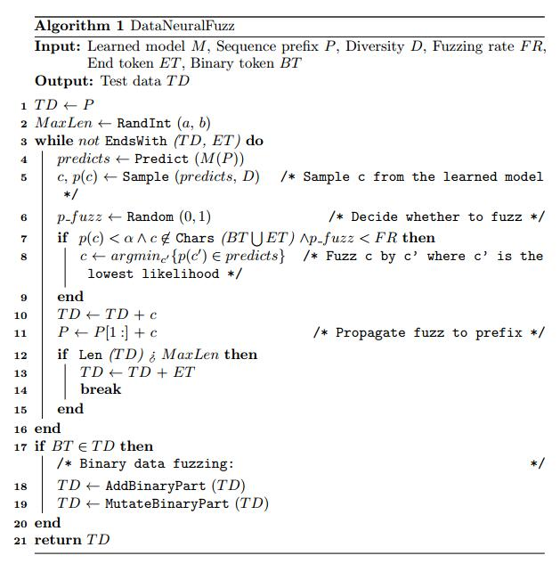

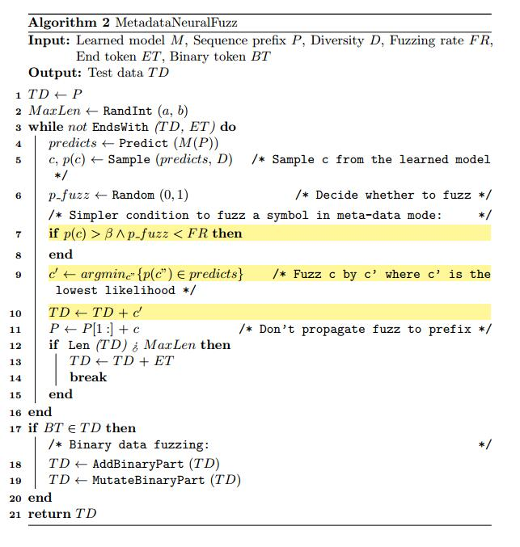

这两种算法的主要特征之一是与SampleFuzz不同，它们总是终止。在每个算法进入其while循环之前，将具有最小值a和最大值b的随机整数设置为T D的最大长度MaxLen变量。如果ET不是由模型产生并且T D的长度大于MaxLen，则在while循环中生成T D期间，然后通过算法将ET添加到T D的末尾，并且while循环将断开。 a和b的值应由测试者确定。一个好的做法是将它们设置在数据集文件的平均长度附近。

### 3.4.1. DataNeuralFuzz 

DataNeuralFuzz算法旨在模糊存储在文件中的数据。存储在不同文件中的数据最明显的特性是其多样性。因此，观察到学习模型预测存储数据的概率低于描述文件格式的元数据。这意味着包含纯数据的位置中的模型预测向量比包含元数据的位置更平滑。使用存储在预测矢量中的概率的这种特性，可以确定数据的类型，如纯数据或元数据。为了确定数据类型，如纯数据或元数据，我们将通过实验获得的阈值α设置为边界线。如果符号c的概率，即p（c）小于α，则c被认为是纯数据。 DataNeuralFuzz用c’替换纯数据项c，其中c‘具有最低似然性，条件是：

1. 符号c的概率p（c）小于给定阈值α。
2. 符号c既不属于BT也不属于ET。
3. 测试仪给出的模糊率FR高于随机数p_fuzz，它是由i.i.d.3随机生成器生成的。

模糊率FR表示在测试数据生成期间要模糊的数据百分比。例如，如果FR设置为0.1，则算法只会对10％的数据进行模糊测试。此外，我们不愿意模糊关键令牌，即BT和ET，因为这些令牌被插入到文件中以分别处理文件的二进制部分和结尾。这就是为什么确保纯数据项c不属于BT和ET的原因。

 纯数据的另一个方面是它看起来像长度大于1的标记。我们的DataNeuralFuzz算法旨在通过更改令牌的一个或多个符号来模糊纯数据令牌。建议[23,6]使用最高可能值更改数据令牌，具体取决于令牌的类型。  在实验上，模糊测试的最佳实践是用其边界值替换数据标记。例如，使用999…… 9而不是整数数据是个好主意。通常，众所周知，用作输入数据的边界值可能导致SUT执行的呈现阶段中的崩溃。

 学习的模型可用于生成任何文件，作为模糊SUT的输入。为此，将一个文件（作为固定长度的输入字符串）提供给模型，模型生成下一个符号。下一次输入字符串向前移动一个符号，这次输入字符串将包括新生成的符号。将得到的字符串再次馈送到学习模型以生成第二符号。只要创建了足够的符号并构建了新的输入文件，就会重复此过程。为了提高生成的输入文件的有效性，每次学习模型生成新符号时，只要保持上述三个条件，我们就在使用符号之前对符号进行模糊处理。每次模型决定通过将此符号添加到下一个前缀来模糊数据令牌的第一个符号时，我们让模型保持模糊预测状态。下一次学习模型想要预测符号时，其预测将受到模糊符号的影响，这可能导致另一个格式错误的符号。我们称这种机制为“将模糊传播到前缀”。

### 3.4.2. MetadataNeuralFuzz

如上所述，我们的fuzzing算法由两个不同的部分DataNeuralFuzz和MetadataNeuralFuzz组成，分别用于生成和模糊生成文件的纯数据和格式/元数据。实际上，生成的文件进一步格式错误，以实现使SUT执行崩溃的更高概率。 MetadataNeuralFuzz尝试使SUT的文件格式解析器崩溃。为了避免被SUT解析阶段中使用的异常处理机制所困，MetadataNeuralFuzz尝试：

1. 应用学习的模型，描述文件的适当结构，以生成新文件，以测试SUT。
2. 使用测试人员给出的特定百分比来模糊描述文件格式的一些符号。

MetadataNeuralFuzz算法旨在模糊文件格式，同时尽可能保留整个文件结构。通过这种方式，MetadataNeuralFuzz可以检查解析器对无效或格式错误的文件格式的健壮性。学习模型本身对元数据和纯数据没有任何假设。它只是在生成文件时预测下一个符号出现的概率。 MetadataNeuralFuzz在生成元数据时对其进行模糊处理。为了区分元数据和纯数据，MetadataNeuralFuzz使用在训练步骤中获得的符号频率。通常，元数据比语料库中的纯数据重复得多。据观察，学习模型比纯数据更高概率地预测元数据，非常接近于1。如果预测符号c的概率大于给定阈值β，则算法猜测符号c可能属于文件格式并用最低发生概率的符号替换它。为了控制模糊符号的百分比，使用模糊率FR。 MetadataNeuralFuzz模糊元数据，假设随机生成的数字p模糊小于由测试者给出的预定模糊测试速率FR。

MetadataNeuralFuzz将ET和BT视为模糊测试，因为这些标记是格式的一部分。当由学习模型生成的符号被模糊时，它仅存储在目标文件中，并且不影响学习模型对下一个符号的预测。以这种方式，确保模糊符号不传播到下一个前缀（MetadataNeuralFuzz算法的第10行）。两个算法MetadataNeuralFuzz和DataNeuralFuzz之间的差异在MetadataNeuralFuzz算法中突出显示，算法2中显示了该算法。

## 3.5实现

为了实现深度NLM，我们使用了一个高级深度学习库Keras [24]。 Keras包含一组高级API，用于构建用Python编写的深度学习模型，并需要一个低级运行时后端来执行深度学习代码。我们决定使用TensorFlow [25]，一个用于机器学习任务的Google框架，作为Keras的后端。我们使用交叉熵作为目标函数，``Adam`` [26]将学习率1×10^-4^和1×10^-3^作为训练过程中的优化算法。我们还应用了`Dropout`[27]技术来防止我们的模型过度拟合。

本文的目的是提供一种自动生成测试数据的方法。但是，单独测试数据生成还不足以进行模糊测试。
为了评估提出的方法，我们需要一个文件格式模糊器。模糊器将测试数据注入SUT并检查意外结果，例如使SUT的存储器崩溃。我们设计并实现了IUST DeepFuzz作为模块化文件格式模糊器。 IUST DeepFuzz使用``Microsoft Application Verifier` [28]，一个免费的运行时监控工具，作为监控模块来捕获任何内存损坏。它还使用微软的另一个工具`VSPerfMon` [29]来测量代码覆盖率。

IUST DeepFuzz的主要模块是一个测试数据生成器，它实现了我们的神经模糊算法。这些模块使用适当的Python和批处理脚本连接。以上配置中的IUST DeepFuzz可以在Windows操作系统上运行。要在其他操作系统上使用它，我们需要更换监视工具，即Application Verifier [28]。测试数据生成器是用Python编写的，可以在任何平台上运行。代码覆盖率测量模块仅用于评估目的，我们的模糊测试不需要它。 IUST DeepFuzz是一款带有混合测试数据生成器的黑盒子模糊器[1]。每个生成的测试数据在注入SUT之前存储在磁盘上，因此如果Application Verifier报告崩溃，则可以检索导致该崩溃的测试数据以进行故障本地化过程。图4显示了IUST DeepFuzz的体系结构和数据流。

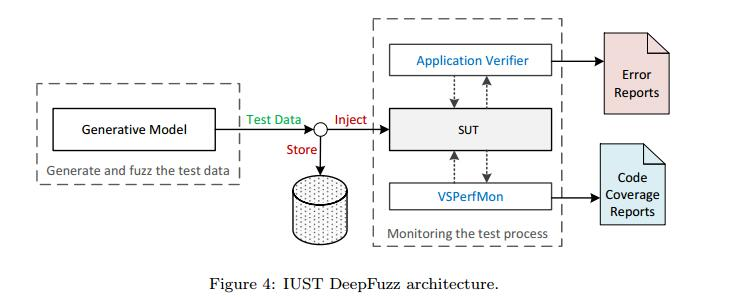

# 4.实验和评估

在本节中，我们将介绍使用IUST DeepFuzz进行实验的结果。我们使用IUST DeepFuzz来模糊MuPDF [10]，这是一个免费的开源PDF，XPS和电子书阅读器，它将复杂的PDF文件[11]作为输入进行处理。 PDF是一种复杂的文件格式。 Adobe PDF规范[11]中描述了PDF文件的完整规范。同样，简要介绍[8]中指定的PDF文件的基本部分。 PDF文件的主要部分是表示文件的所有功能和方面的数据对象。按照[8]中提出的方法，我们在PDF对象集上训练我们的模型，然后生成新的PDF文件到模糊MuPDF查看器[10]。

我们还实现了Learn＆Fuzz方法[8]并在MuPDF查看器[10]上进行了评估，因为Edge PDF解析器和Learn＆Fuzz的其他材料包括数据集和模型超参数，并未公开提供。通过这种方式，我们能够在我们提出的方法和提到的方法之间进行有意义的比较，作为该领域最相关的工作。

## 4.1.评估指标

模糊测试的主要目的是在SUT中查找与代码覆盖率有关的故障和漏洞。学习文件结构的主要目标是生成与模型精度相关的格式良好的文件。根据这些事实，我们在实验中考虑以下指标来衡量我们提出的方法的有效性。

1. **模型准确度和误差**：这些指标基于Keras [24]在训练每个模型时报告的目标函数。精度和误差是根据验证集数据计算的，验证集数据是从预处理阶段的数据集中导出的。
2. **模型困惑度**：困惑度是评估LM的最常见指标，它被定义为[30]：

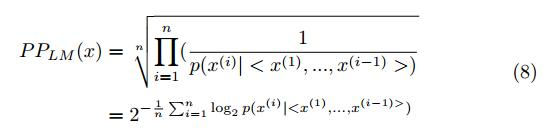

在等式8中，x是具有长度n的序列以评估困惑度。困惑表明预测序列和测试集序列之间的差异。因此，较低的困惑意味着更好的LM。对于每个模型，我们在训练期间计算验证集的困惑度。我们使用困惑来评估所提出的模型在捕获输入文件的结构方面的优异性以及比较不同的建议NLM。

3. **代码覆盖**：对于每个测试数据执行，基本块覆盖由VSPerfMon工具[29]测量。基本块覆盖是语句覆盖的扩展，其中每个非分支语句序列被视为一个语句单元。基本块覆盖的主要优点是它可以低开销应用于目标代码。测试集的总覆盖范围是各个覆盖范围的并集。 VSPerfMon还报告行覆盖率，这与高级代码的语句覆盖率相同。
4. **故障和漏洞**：对于每个测试数据执行，Application Verifier [28]创建一个日志文件。然后，我们使用简单的脚本搜索这些日志文件，以查找任何错误或安全警告。

前两个指标确定了学习文件格式的有效性，接下来的两个指标衡量了模糊测试的质量和实用性。 

## 4.2.实验设置

表1中的训练模型是在具有单个Nvidia GTX 1080 GPU，Intel Core i7 CPU和20 GB RAM的物理ubuntu 16.04机器上进行的。模糊测试在具有Intel Core i7 CPU和8 GB RAM的虚拟Windows 10计算机上完成。我们在进行实验时使用了最终版本的MuPDF查看器[10]，即版本MuPDF 2017-04-114。

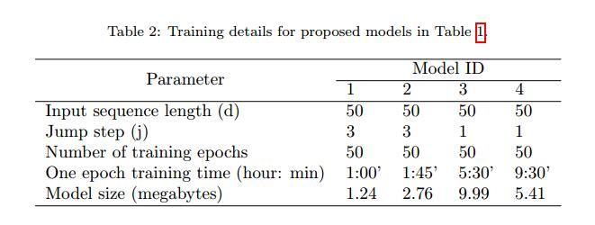

在我们生成测试数据之前，我们应该训练我们的模型。表2显示了我们模型的关键超参数以及每个模型的时期数和训练时间。模型的复杂性，即训练参数的数量，随着模型的ID而增加。对于更复杂的模型，获得更多训练样本是合理的。因此，在模型3和4中，我们减少跳跃步骤，这导致增加训练样本。在模型3中，我们使用Dropout [27]和p = 0.3进行正则化。

## 4.3.数据集和主机文件

深度神经网络的成功训练需要大量且足够的数据集。因此，我们从各种来源收集了大量PDF文件，包括Mozilla PDF.js开放测试语料库[31]，AFL [13]中使用的一些PDF作为初始种子，以及从不同语言的公共网络收集的PDF。 最后，我们发布了IUST PDF Corpus超过6000个PDF文件。此类语料库之前未公开发布，也可用于其他类型的PDF操作和测试。

为了学习PDF对象的统计结构，我们从IUST PDF Corpus提取了500000的个对象。这些对象中约有27％具有二进制流。我们用二进制令牌流替换二进制流，提取并将它们存储到单独的数据集中，并在我们的训练过程中包含修改后的对象。与[8]的一个关键区别是我们在提取对象之前没有应用种子最小化，因为我们想要学习文件的结构，更多的数据可能会改善学习。整个提取的PDF数据对象集可在IUST PDF Corpus中找到。

由于我们只学习和生成PDF对象，因此我们需要一种机制来创建完整的PDF文件。按照[8]中提出的方法，我们决定将新生成的对象附加到现有的格式良好的PDF文件中，称为host。PDF文件可以按照PDF参考指南[11]中的说明逐步更新。新对象附加到现有PDF的末尾，其偏移量将添加到交叉引用表中。此方法允许用户更新PDF文件而无需重写整个文件。实际上，新对象重写现有对象的内容，该对象由ID标识并且绝对是旧标识。有关增量更新的更多详细信息，请参见[11]。

下一步是选择主机文件。在[8]提出的工作中，这几乎是随机的，只从他们的语料库中选择最小的三个PDF文件。
针对这项工作，为了研究主机复杂性对代码覆盖率的影响，我们首先通过运行MuPDF计算语料库中所有PDF文件的代码覆盖率，然后选择具有最大，最小和平均代码的三个文件覆盖范围分别为host1_max，host2_min和host3_avg。

## 4.4.代码覆盖的基线

为了将新生成的PDF文件的代码覆盖率与现有的PDF文件进行比较，我们首先测量了每个主机的MuPDF [10]代码覆盖率，然后构建了1 000个PDF文件，其中包含从测试集中随机选择的对象。这些对象以两种不同的模式附加到主机文件：

1. 单个对象更新（SOU）：查找主机文件中的最后一个对象ID，并用新对象重写它。在此模式下，每个文件中只会更改一个对象。
2. 多个对象更新（MOU）：重写每个PDF文件中对象的固定部分。首先，在此模式中，计算主机中的总对象数，然后新对象将覆盖随机选择的对象ID列表。
   

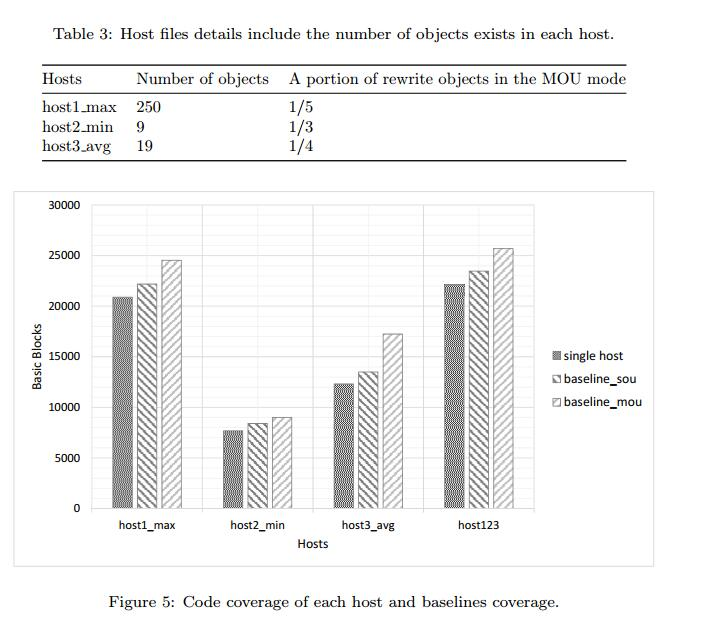

表3显示了每个主机中的对象数以及MOU模式下重写对象的部分。图5显示了通过在三个主机上运行MuPDF查看器获得的代码覆盖率，除了两个测试套件的覆盖范围，一个用于SOU，称为基线源，一个用于MOU，称为基线mou。 host123表示从主机1,2和3获得的代码覆盖的并集。观察到以下结果。 

- 每个基线的代码覆盖率高于单个主机的覆盖范围。这意味着更改主机会增加代码覆盖率。
- 基线覆盖范围与主机覆盖范围有直接关系。例如，host1_max在host1_max，host2_min和host3_avg中具有最高的代码覆盖率。这表明选择合适的主机文件是一项基本工作，并对基线覆盖率产生重大影响。
- 在所有情况下，基线mou的代码覆盖率均大于基线。  这意味着进一步修改文件内容会增加代码覆盖率。
- 最大代码覆盖率属于host123，表示每个主机已执行不同的基本块。
- 最后，覆盖代码的顺序在20,000个基本块的范围内，显示MuPDF查看器[10]是一个大型应用程序，PDF文件具有复杂的格式。 

## 4.5.模型评估

表4显示了在50个时期训练后我们的模型的困惑，准确性和误差。名为laf的最后一列显示了Learn＆Fuzz模型的这个值[8]。 Keras报告了这些指标。困惑由公式8计算。准确度和误差来自交叉熵损失函数。图6还显示了训练过程中模型2和模型laf的验证错误图。模型2已在此图中说明，因为它与架构和超参数设置中的laf最相似。观察到以下结果。

- 所有NLM的误差小于laf误差，并且它们的准确度大于它。这意味着NLM在文件的学习语法中优于编码器 - 解码器模型。
- 最大精度属于模型4，我们唯一的双向LSTM。该网络以从左到右和从右到左的方向处理输入序列。因此它可以达到较高的准确度，从而导致较低的困惑。
- 在图6中，模型2的错误图始终位于模型laf下当然，迭代有不同的时期，因此点对点比较可能并不令人兴奋。但是，我们也看到这种关系在训练过程开始时的相等间隔内是正确的。
- 在我们的数据集中，所有模型的最大困惑是在没有NLM的情况下是困惑的。 50个训练时期之后的困惑度小于1.5，这表明NLM可以学习如此优秀的文件语言。最小困惑属于具有最大可训练参数数量的模型3。

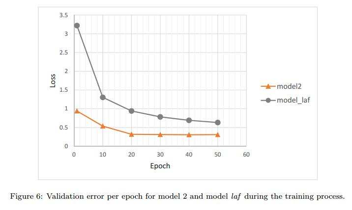

## 4.6.采样多样性和代码覆盖率

为了研究生成测试数据时多样性对代码覆盖率的影响，我们使用不同多样性0.5,1.0和1.5的采样策略在每个主机上生成1,000个PDF文件。该实验提供了关于代码覆盖中的最佳模型，主机，分集和更新模式（即，SOU和MOU）的信息。因此，我们可以选择用于模糊测试的最佳配置。 我们在训练时间的每个时期结束时保存一个检查点，然后选择所有检查点之间具有最小验证误差的模型。我们选择最佳学习模型进行抽样。

在SOU模式下使用我们的模型生成1,000个PDF文件大约需要60分钟，在MOU模式下大约需要190分钟。在MuPDF查看器上运行每个测试套件并获得覆盖平均花费65分钟。总的来说，我们在此实验中生成并测试了72,000个PDF文件。所有代码覆盖率如图7所示。观察到以下结果。

- 在大多数情况下，生成数据的代码覆盖率小于基线代码覆盖率，因为生成的对象在我们的测试集中并不是真正的PDF对象。但是，在这种情况下，我们会看到代码覆盖率的增加，例如在图表host2_min_mou中。这意味着对于小型主机，添加更多内容会导致更好的代码覆盖率。
- 增加多样性会导致双向LSTM（模型4）中的代码覆盖率增加，但其他模型则不然。通常，在大多数模型和大多数主机上生成具有分集一的数据似乎更有效，而不是SUT的代码覆盖。
- 几乎在所有图表中，模型2在代码覆盖率方面优于其他模型。这意味着更简单的NLM比更复杂的NLM更好。
- 通过查看host123图表，作为结果的汇总，我们可以得出结论，具有多样性的模型2是模糊测试的最佳模型。
  因此，我们选择此模型用于4.7节中的神经模糊算法。

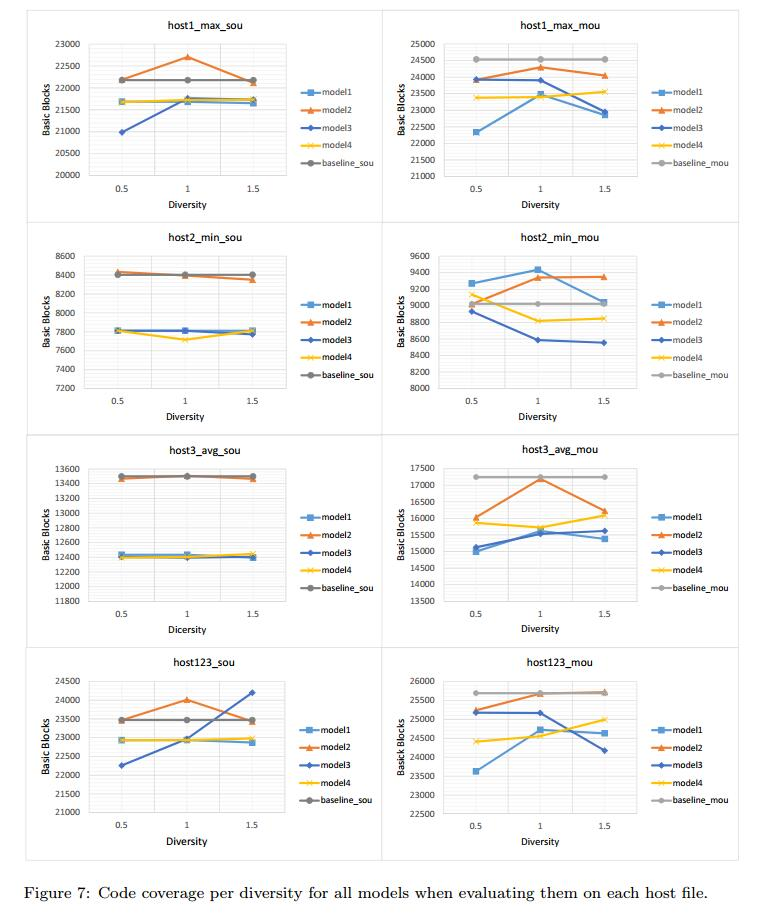

## 4.8.神经模糊测试

在第四次和最后一次实验中，我们将MuPDF [10]放在真正的模糊测试上。我们使用DataNeuralFuzz和MetadataNeuralFuzz算法生成10,000个PDF文件，然后使用IUST DeepFuzz进行模糊测试。除了模糊我们的神经模糊算法外，我们还通过FileFuzz [5]进行模糊测试，这是一种基于变异的简单文件格式模糊器，以及Learn＆Fuzz（即SampleFuzz算法）[8]。在所有实验中，我们使用host1_max作为主机文件或FileFuzz的初始种子。在这个实验中，我们用40,000个PDF文件模糊了MuPDF查看器。

表5显示了为DataNeuralFuzz和MetadataNeuralFuzz算法设置的输入和常量值，以便在可用值中生成测试数据。表6显示了各种模糊测试方法的代码覆盖率结果，包括Learn＆Fuzz [8]和FileFuzz [5]。最后，表7显示了我们提出的方法和其他四种已知文件格式模糊器的代码覆盖率之间的差异：Learn＆Fuzz，AFL [13]，Augmented-AFL [14]和FileFuzz。微软研究最近推出了增强型AFL作为AFL的改进。观察到以下结果。

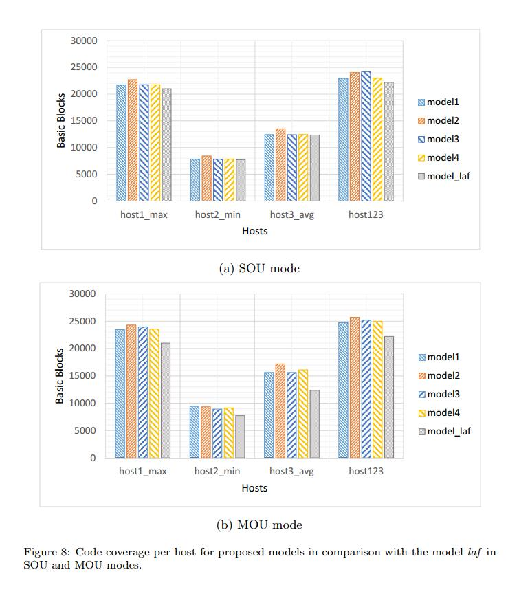

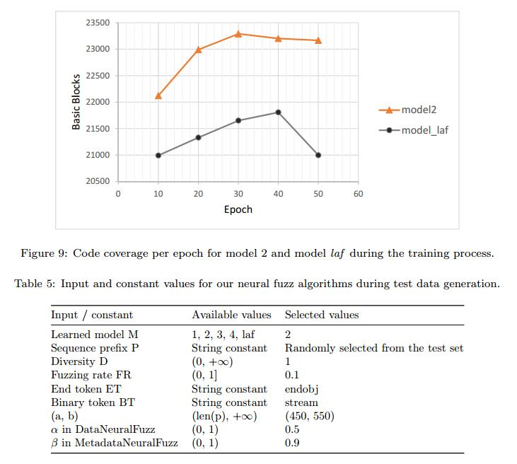

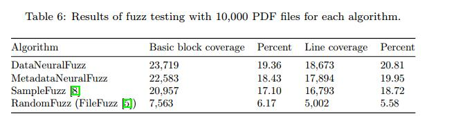

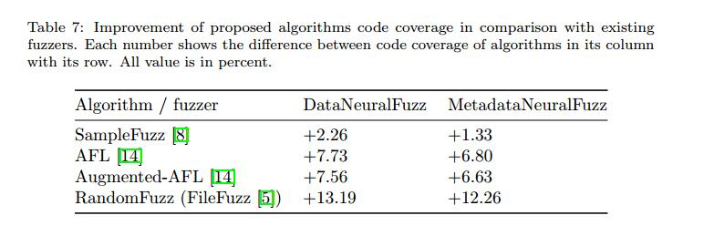

- MetadataNeuralFuzz代码覆盖率低于DataNeuralFuzz。正如我们已经说过的那样，操作文件格式的一小部分可能会使其完全无效，因此解析器会尽快拒绝该文件并导致代码覆盖率降低。但是，更改文件中的数据会影响文件执行的呈现阶段。结果证明两种算法都符合我们的预期。一个fuzzes格式，另一个fuzzes数据。
- 与SampleFuzz [8]相比，DataNeuralFuzz和MetadataNeuralFuzz都覆盖了MuPDF查看器代码的更多基本块（当然还有更多行）。这表明带有RNN的NLM在模糊测试中优于编码器 - 解码器模型。另一种解释是混合测试数据生成优于基于生成的方法。
- 我们的混合测试数据生成方法也优于基于突变的模糊器，如AFL和AugmentAFL，如表7所示.AFL和增强AFL的代码覆盖率取自[14]作为基准。
- 基于模糊测试的测试数据生成部分，智能算法与随机变 异的优势是显而易见的。随机算法无法访问复杂输入结构中的高代码覆盖率。 DataNeuralFuzz算法的覆盖范围是FileFuzz [5]中使用的算法的三倍多。
- 尽管我们在模糊测试过程中改进了MuPDF查看器[10]的代码覆盖率，如表6所示，覆盖代码的百分比仍然低于25％。这意味着大多数观众代码都没有被执行，这不是好消息。另一方面，我们应该知道MuPDF查看器可以解析和播放不同的文件格式，如XPS。这意味着当输入采用这样的格式时，将使用部分未执行的代码。因此，我们不希望仅通过生成和注入PDF文件来运行它们。
  
## 4.9.故障和漏洞

可用于评估模糊器的最佳度量标准是在模糊测试期间发现的故障和漏洞的数量。在每次测试执行后，我们没有看到Application Verifier [28]生成的报告中出现任何错误。鉴于我们测试了MuPDF软件的最终版本[10]，假设其大多数错误在试用版本中得到修复，因此很难找到新的错误。另一方面，MuPDF是正在积极开发的软件，它拥有出色的开发人员和用户社区，使其成为强大的软件。但是，DataNeuralFuzz算法检测到不安全功能的多种用法，并将其报告为安全警告。

似乎Application Verifier [28]在Windows 10 x64上运行时无法检测到32位应用程序的内存错误。我们尝试使用已知错误对一个简单的32位应用程序进行模糊测试，但ApplicationVerifier不会报告任何内容。 64位应用程序但没有这样的问题，它们的错误由ApplicationVerifier检测到。因此，我们测试了32位和64位版本的MuPDF查看器[10]。 IUST DeepFuzz打开带有测试数据的SUT并在固定时间后关闭它，尝试在测试套件中注入下一个测试数据。在我们的配置中，每个测试套件包含10,000个测试数据，需要大约28个小时进行处理。模糊测试是一种压力测试，通常在几天或几周内完成，以发现故障和漏洞。我们计划在更大规模的测试服上测试MuPDF，其中包含100,000个PDF文件以及更多可能会破坏MuPDF的文件。

# 5.相关工作

在本节中，我们将讨论一些相关的模糊测试工作，并解释他们在测试数据生成方面存在的问题。根据测试数据生成方法，模糊器分为基于突变和基于生成[32,33,34]。将各种技术应用于两种方法以改进它们。大多数这些技术都专注于人工智能算法。

**I.基于突变的模糊测试**。在基于突变的情况下，使用一个或多个有效输入数据作为初始种子。然后该种子发生变异以产生另一个测试数据。很容易构建基于突变的模糊器并用它生成错误形成的测试数据。在这种情况下，不需要事先理解输入数据结构。基于突变的方法的缺点是该方法取决于初始种子的变化。如果没有不同的样本输入，基于突变的模糊器就无法实现高代码覆盖率[35]，这表明初始种子在基于突变的方法中的重要性。 AFL [13]和FileFuzz [5]是基于突变的模糊器的例子。

**II.基于生成的模糊测试**。基于生成的方法完全随机地生成测试数据，或者从诸如语法，模板或模型的形式描述生成测试数据。最新的使用输入格式规范来构建生成模型。此方法通常应用于某些文档可用的格式。通常，与基于突变的模糊器相比，它实现了更高的代码覆盖率[35]。但是，正如我们所说，应该花费大量的时间和金钱来完全理解文件格式的规范，并为它构建正确的语法，模板或模型。 SAGE [36]和Peach [37]是基于生成的模糊器的例子。还存在利用两种方法的特征的混合方法。 IUST DeepFuzz在本文中提出了一种混合模糊器，它通过生成模型生成结构化文本数据，通过突变生成非结构化二进制数据。

**III.进化模糊**。通过应用遗传等进化算法[38]，首次尝试将模拟带入模糊测试。进化模糊器从运行时信息（通常是代码覆盖率信息）接收反馈，并将导致新执行路径的测试数据添加到队列中。之后，当模糊器想要生成测试数据时，它只会改变队列中存在的测试数据，希望能够运行代码的新部分。 AFL [13]是最先进的进化文件格式，模糊器的工作方式与上面完全相同。通过使用先前运行的反馈，AFL可以选择更好的测试数据，但是，它会随机改变它们。结果，将生成大量重复的测试数据，这些数据不一定影响包括代码覆盖的测试标准。另一方面，在复杂的输入结构中，更改某些关键部分会导致输入测试数据在解析的初始阶段被解析器拒绝。因此，我们需要一种机制来告知fuzzer输入文件的变异（偏移）。

**IV.基于变异和进化方法的深度学习**。Augmented-AFL [14]作为AFL [13]的改进补丁，尝试使用深度学习技术找到适合变异的位置。在Augmented-AFL创建新的测试数据后，它会查询模型以查看生成的测试数据是否足够好？这种方法提高了测试速度，但是大量数据在生成时被模型（否决）拒绝。此外，Augmented-AFL在MuPDF解析器的代码覆盖率方面没有显着改进[10]。对于具有复杂输入结构的应用程序而言，基于突变的方法似乎无法丰富高代码覆盖率。

**V.基于生成方法的深度学习**。 Godefroid等人最初提出了应用基于神经网络的统计学习从样本输入自动生成输入语法。 [8]。他们还提出了一种生成模糊输入的算法。这项工作的主要思想是学习一组PDF文件的生成模型[11]。为此目的，他们使用一种序列来对结构进行排序[15,16]，其最初用于将来自不同域的两个序列映射到一起，例如机器翻译的任务。他们称他们的方法为Learn＆Fuzz。在整篇论文中，我们讨论了Learn＆Fuzz方法的一些弱点，并为它们提供了一些解决方案。基于这项工作，Cummins 等人介绍了使用RNN [21]的LSTM架构对程序代码进行建模的DeepSmith [39]。他们将该工具应用于OpenCL编程语言的模糊编译器。他们的模型不是混合模型，只能用于生成文本测试数据。

# 6.结论

本文旨在为复杂的输入结构（如PDF文件）引入新的智能测试数据生成技术。由递归神经网络构建的深度神经语言模型可以最好地应用于将复杂输入文件的结构学习为符号序列。可以简单地学习输入文件的文本部分。但是，学习二进制部分的格式是一项艰巨的任务。为了解决这个难题，我们建议暂时删除二进制部分，并用特定的标记替换这些部分。在训练阶段完成之后并且当应用学习模型来生成测试数据时，将令牌替换为已删除部分的变异形式。为了提高模糊效率，我们在应用学习模型时将数据和元数据模糊，以生成新的输入文件作为测试数据。我们相信，无论代码覆盖范围如何，在完成模糊测试时都需要这两种算法。神经模糊算法旨在测试程序的不同部分。 MetadaaNeuralFuzz测试文件格式的解析器和DataNeuralFuzz测试文件格式的渲染器。

测试数据生成器是模糊器中最重要的模块。提供可以在被测软件中实现高代码覆盖率的自动测试数据生成器，尤其是具有复杂输入结构的目标，对于发现故障至关重要。已经成功地应用基于生成和基于突变的方法来生成用于模糊测试的测试数据。但是，前者不是完全自动的，后者的代码覆盖率很差。

为了解决这些问题，我们提出了一种基于NLM和深度学习技术的方法。我们的混合测试数据生成方法自动学习输入文件的结构，然后通过模糊输入格式的文本和二进制部分来生成新的多样化测试数据。由于该方法智能地确定了模糊的位置以及应该用于模糊的值，因此可以有望地应用于测试复杂目标。

我们以复杂的文件格式（即PDF）进行了实验，结果证实了与以前的方法相比，代码覆盖率和我们提出的方法的准确性得到了显着改善。除了一般结论之外，我们的分析揭示了一些有价值的经验事实，最值得注意的是：

- 混合测试数据生成用于模糊复杂输入结构的文本和二进制部分，增加SUT的代码覆盖率。
- 人们普遍认为，作为LM的双向LSTM可以在同一数据集上获得更高的精度和更少的误差。然而，观察到更简单的NLM，例如没有丢失的单向LSTM，例如本文中的模型2，在代码覆盖中可以胜过更复杂的方法。[14]报道了类似的结果。
- 基于具有高代码覆盖率的PDF文件的增量更新过程会导致更多代码覆盖。
- 尽管提供比随机和现有智能模糊器更高的代码覆盖率，但我们提出的模糊器可以改进，以便为复杂的输入结构（如PDF文件结构）提供更高的覆盖率。
  

关于这个主题，未来有很多工作要做。一种是使用其他强大的深度学习模型，如生成对抗网络（GAN）[40]来生成测试数据。另一个方向是应用这些模型在其他类型的模糊器（如网络协议模糊器）中生成测试数据。为了生成更有效的测试数据，我们打算向IUST DeepFuzz添加一个反馈循环，旨在接收运行时信息并微调学习模型。 SUT中有部分代码处理用户交互。然而，诸如AFL [13]和IUST DeepFuzz之类的模糊器不利用用户交互部件进行模糊测试，并且不支持执行这些部分代码。目前，我们计划支持用户与SUT交互的自动化

