# Abstract

Fuzzing是一种流行的动态程序分析技术，用于发现复杂软件中的漏洞。模糊测试涉及使用精心设计的恶意输入来呈现目标程序，该输入旨在导致崩溃，缓冲，内存错误和异常。以有效的方式制作恶意输入是一个难以解决的开放问题，通常产生此类输入的最佳方法是通过对预先存在的有效输入（种子文件）应用统一的随机突变。我们提出了一种学习技术，该技术使用神经网络从过去的模糊探索中学习输入文件中的模式，以指导未来的模糊探索。特别地，神经模型学习一种功能，以预测输入文件中的好（和坏）位置，以基于过去的突变和相应的代码覆盖信息执行模糊突变。我们实现了几个神经模型，包括LSTM和可以编码可变长度输入文件的序列到序列模型。我们将模型整合到最先进的AFL（American Fuzzy Lop）模糊器中，并在代码覆盖范围，独特的代码路径以及各种输入格式（包括ELF，PNG，PDF和XML）的崩溃方面显示出显着的改进。

| relevant information |                                                     |
| -------------------- | --------------------------------------------------- |
| *作者*               | Mohit Rajpal; William Blum; Rishabh Singh           |
| *单位*               | Microsoft Research                                  |
| *出处*               | CoRR杂志                                            |
| *原文地址*           | <https://arxiv.org/abs/1711.04596>                  |
| *源码地址*           | https://github.com/arvindrao7589/augmented-afl-fuzz |
| *发表时间*           | 2017年                                              |

# I  简介

模糊测试[18]，[12]是最广泛使用的自动化软件测试技术之一，已成功地在复杂程序中自动发现大量安全漏洞。模糊测试的关键思想是不断生成新的恶意输入，对目标程序进行压力测试，以发现崩溃，缓冲流或异常等意外行为。通常，模糊器以一组初始种子输入文件启动，通过随机突变，约束求解或使用一组手动定义的启发法连续转换以生成恶意输入。由于输入格式可能非常复杂，因此生成恶意输入通常需要数百万个突变，因此模糊测试过程可以被视为一个巨大的搜索问题，可以识别出一组良好的突变，从而导致更高的代码覆盖率和更多的崩溃。在本文中，我们提出了一种学习技术，该技术使用神经网络从先前的模糊探索中学习输入文件中的模式，以指导未来的模糊探索。特别是，神经模型学习输入文件中不同位置的分布以应用突变，这反过来又用于指导模糊过程以探索新的唯一代码路径和崩溃。

目前的模糊测试技术大致可分为三大类：i）Blackbox模糊测试[18]，[14]，[1]，ii）Whitebox模糊测试[12]，以及iii）Greybox模糊测试[26]。Blackbox模糊器将目标程序视为黑盒子，程序内部没有内部检查。相比之下，白盒模糊器需要知道正在测试的程序的结构（可能但不一定是通过程序源代码的分析）来生成输入突变以特定地针对某些代码片段。Greybox模糊器形成了一个中间地带，他们执行有限的源代码检查，例如使用轻量级代码检测计算代码覆盖率。尽管所有模糊测试技术都有不同的优点和缺点，但基于随机突变的灰盒模糊技术已经导致AFL（American Fuzzy Lop）[26]等模糊测试，它已经成功地在复杂程序中发现了大量的实际错误。 greybox模糊器的成功很大程度上源于其简单性，允许有效的低级实现。在本文中，我们探讨是否有可能使用机器学习来学习基于先前执行输入历史和代码覆盖率信息来指导输入突变的策略。更具体地说，我们的目标是学习一种能够预测输入文件中最佳位置以执行突变的功能。我们首先在有限时间内运行传统的模糊测试技术，以获取有关哪些突变导致新代码覆盖的数据，然后使用此数据来学习一种功能，以指导进一步的输入修改以产生新的有前景的输入。虽然我们的技术适用于任何模糊测试系统，但我们在当前最先进的AFL模糊器[26]上实例化它，这是一种基于遗传算法的灰盒模糊器。AFL对一组种子输入文件执行随机变换，并维护有希望的新输入文件的输入队列，这导致执行新的代码路径。由于难以使用随机突变精确地改变输入文件，通常会丢弃数百万新生成的输入，并且只考虑其中的少数（在输入队列中）以用于将来的突变。我们的技术旨在学习如何指导这一输入生成过程，以最大限度地减少生成无意义输入所花费的时间，从而增加模糊器覆盖新代码路径的机会。

我们实现了几种神经网络架构，以学习在给定一组输入修改的情况下预测预期代码覆盖图的功能。由于输入文件可以有不同的长度，我们使用LSTM（长短期记忆）[15]和序列到序列的结构，注意[3]可以编码可变长度序列。在模糊测试时，我们使用学习函数来预测完整输入文件的热图，其对应于导致新代码覆盖的每个文件位置的突变的可能性。然后，我们使用覆盖图来确定突变位置的优先级。为了训练这些功能，我们首先在种子文件子集上运行AFL一段有限的时间，并获得突变覆盖的训练数据信息。

我们在几种输入格式（如ELF，PNG，PDF和XML）上评估我们的技术。我们观察到神经增强AFL导致ELF和PNG解析器的代码覆盖率明显高于AFL，而对于PDF和XML解析器，覆盖范围具有可比性。我们观察到神经增强AFL始终导致为ELF，PNG和XML解析器探索显着更多数量的唯一代码路径。最重要的是，对于ELF和XML解析器，神经引导AFL的观察到的崩溃次数显着增加。我们观察到PDF解析器的覆盖率改善较小，因为学习模型需要额外的时间来预测大型PDF输入文件上的覆盖图，但我们相信通过一些额外的性能工程可以提高性能。本文的主要贡献如下：

- 我们使用不同的神经网络架构模拟了在输入文件中模拟有前途位置的模糊问题。

- 我们提出了一种技术，可以有效地训练位置预测功能，然后使用学习的功能进行模糊测试。

- 我们在最先进的AFL模糊器中实现我们学习的神经模型，并表明它会导致更多的代码覆盖，独特的代码路径以及不同输入格式的崩溃。

# II AFL背景

AFL是最先进的greybox进化模糊器。AFL有一个简单的策略来制作恶意输入：尝试许多小的局部突变到种子文件，以及一些堆叠突变，同时突变种子中的许多位置。 AFL的优势在于其遗传算法。 AFL仪器在编译期间获取源代码，以便在执行期间访问代码覆盖率。在执行目标程序期间，AFL观察到变异种子诱导的代码覆盖。如果一个变异的种子诱导了一些前所未见的代码要执行，或者如果它改变了之前看到的代码片段的执行频率，那么它就被认为是有趣的。这被称为输入增益。 AFL保存突变的输入，这些输入诱导输入增益并将它们视为进一步的种子文件以进行变异。种子池的这种不断演变有助于达到许多模糊的代码路径，这需要许多迭代的小突变才能到达。这个池也经常被淘汰，以挑选最好的种子进行变异。AFL的策略在成熟的开源项目中发现了许多错误，例如Mozilla Firefox，ffmpeg，OpenSSL，clang等。简单的黑盒随机模糊器和AFL模糊器的核心算法的比较如图1所示。

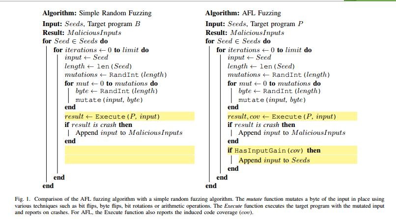

模糊测试是计算密集型的。即使很小的输入增益也需要数千到数百万的随机突变才能发现。然而，并非所有突变都是平等的。文件格式及其解析器是异构的。我们认为文件头或其他关键部分的突变更有可能产生输入增益。这可能是一种情况，因为许多条件分支依赖于小的关键部分。相反，包含原始数据的部分不太可能产生输入增益，因为它们通常由紧密循环中的小块代码读取。然而，在没有大量领域专业知识的情况下手动识别复杂输入格式的这些位置是困难的。

自然的下一步是编纂定量技术，以自动识别最佳位置以进行变异。我们研究基于神经网络的机器学习技术，使用代码覆盖反馈自动识别输入文件中的有用位置。

# III 框架概述

我们的框架由一个模糊器和一个模型组成，它突出了输入文件中的有用位置。在运行期间，模糊器查询每个种子文件的模型，并将突变集中在突出显示的位置上。突出显示种子文件的样本如图2所示。给定以字节序列格式的输入文件，该模型注释热图函数，突出显示改变输入文件中每个位置的相对效率。由于种子文件的长度可变，该模型被定义为一系列函数。

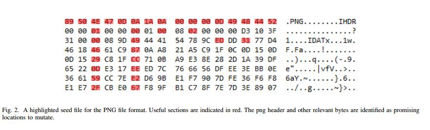

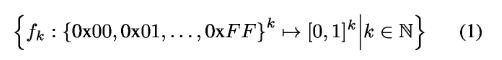

为简单起见，我们将这一系列函数表示为简单的f，它可以将任意数量k的输入位置作为输入。该函数将输入文件中的每个位置与产生输入增益的突变概率相关联。在增强执行期间，模糊器首先在执行突变之前查询该模型，并使用所得到的热图来指导突变朝向有用位置。针对少数有用位置的潜在输入在增强执行期间被否决;这可以通过避免对不太可能提供输入增益的输入执行来节省时间。形式上，变异输入被否决，除非它满足等式2中所示的所需截止值。

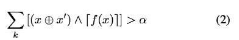

这里

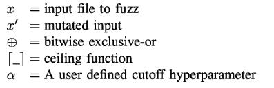

面上，x ⊙ x’ 是相对于种子的变异输入的差异。等式2中的关键思想是仅考虑修改许多有用字节位置的差异，如 f(x) 所示。α参数控制必须突变的“有用”字节数。热图功能f的这种表达很容易并且有效地与任何模糊系统集成，因为它在任何种子文件的开始执行一次热图计算。

为了训练模型来学习函数f，需要输入文件和相应的代码覆盖。特别是，以下元素用于训练模型：

- x：种子文件被模糊; 

- b：通过在x上执行目标程序产生的代码覆盖位图; 
- x’：变异的种子文件; 
- b’：通过在上执行目标程序产生的代码覆盖位图。

请注意，这些数据元素是大多数greybox模糊器的第一类公民，不需要额外的工具来生成。Blackbox模糊器也可以轻松扩充，以生成目标程序的代码覆盖率信息。

虽然很明显代码覆盖率缺乏变化表明突变应用于无用位置，但没有直接的方法通过（输入，代码覆盖）元组确定有用的位置。在b,b’的一些评分上创建监督的训练数据集对的一般框架，表示为s(b,b’)，是：

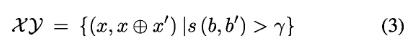

对于某些实值截止值γ。给定训练数据集，目标是学习一个模型，该模型可以将输入文件x映射到差异热图x ⊙ x’，这反过来可以用于识别可能有用的位置，以集中模糊变形的注意力。

上述方法的优点在于它导致剔除无用突变，其得分低于有用突变。从数据集学习的模型将在监督设置中获得许多得分良好的(x, x ⊙ x’)对。单个种子通常与许多突变配对。为了最大限度地减少这种“一对多”关系的总损失，学习了给出x：E[(x ⊙ x’)| x ]的diff  x ⊙ x’的期望值。这捕获了在某些位置移动字节的相对有用性。

原则上，s(b,b’)的有效化身具有挑战性。s(b,b’)的所需行为突出显示导致输入增益的突变，从而导致目标程序中“从未见过”的执行行为。这种对模糊测试历史的顺序依赖需要一个以先前的覆盖历史为条件的函数s*，遗憾的是，这对于学习模型的方法来说是困难的。因此，我们选择 s *的直观近似：

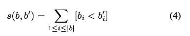

其中bi表示位图b的第i位，|b| 表示位图的长度。表I中给出了按位严格小于函数的真值表。

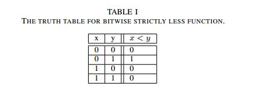

按位'严格小于'评分函数突出显示未在b中执行但在 b’ 中执行的代码段。此功能奖励代码覆盖率增加。在实践中，我们发现这种评分功能可以在很多目标计划中取得良好的效果。

# IV 学习增强模糊

我们用于学习增强模糊测试的设计包括对AFL的修改以及用于预测模糊的最佳位置的神经网络模型。

## A.增强型AFL

我们为这项工作增加了AFL模糊器以利用神经模型。Augmented-AFL在模糊测试之前使用每个种子查询神经网络模型。神经模型将种子分类为字节粒度的有用和无用部分，该部分在模糊测试期间使用。在执行之前，没有针对没有有用部分的突变被否决。这种增强方法如图3所示。

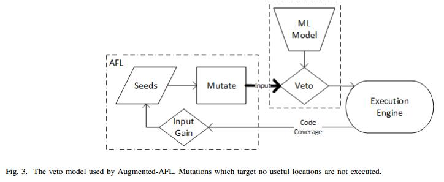

AFL模糊测试策略应用以下小的局部突变。请注意，以下所有突变均在连续切片上进行。

- 位flips：通过一次移位[1/2/4]位来改变输入。

- Byte flips：通过应用exclusve或[1/2/4]字节（0xFF）来改变输入。

- 算术突变：通过以[1/2/4]字节粒度添加/减去感兴趣的量来改变输入。

- 有趣的替换：通过以[1/2/4]字节粒度拼接“有趣”值来改变输入。

- 字典替换：通过用用户提供的“有趣”值替换字节来改变输入。这些长度可能超过4个字节。

上述所有突变都是小的局部变化，对于给定的种子，其变化非常大。在确定性阶段结束后，AFL开始堆叠许多这些小的局部突变，这些突变是非局部的并且相对于输入具有显着的汉明距离。AFL可以应用于均匀选择的2到128个堆叠变化之间。除了前面提到的位置突变，还可以应用以下突变：

- 随机字节分配：将随机值分配给随机字节。

- 删除字节：删除输入文件的一部分。

- 克隆字节：将字节附加到输入文件的一部分。

- 覆盖字节：覆盖输入文件的一部分。

由于AFL模糊测试的位置和上下文不敏感性，大多数突变不会产生任何输入增益。增强模糊测试的目标是提高突变的命中率。使用模型提供的注释种子，避免了不太可能提供输入增益的突变。我们使用了一种高度宽容的否决方法来拒绝不针对任何有用位置的突变。增强变异算法如图4所示。

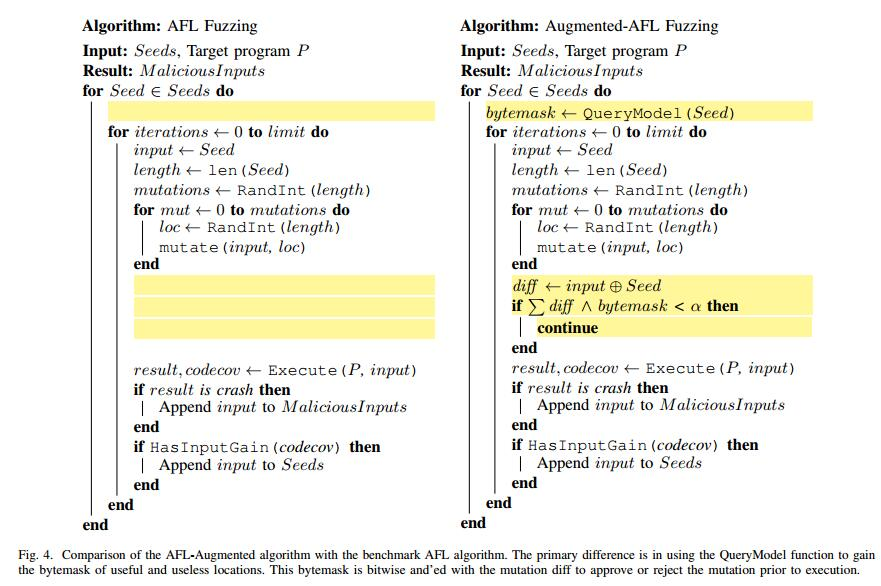

## B.神经网络架构

我们现在描述用于学习覆盖热图预测功能的不同神经网络架构。回想一下，要学习的函数族具有以下格式：

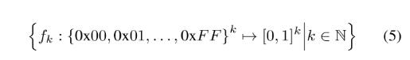

该系列函数的可能编码方案是将输入“按原样”提供给底层神经网络。这将涉及将数据编码为[0, 255]范围内的实值浮点数序列。然而，这是次优的，因为二进制数据不一定代表量值，但也可以代表状态。假设每个字节表示数字量，它可以表示位掩码或其他非数字值是不正确的。因此，我们以“比特序列”格式编码字节级信息：

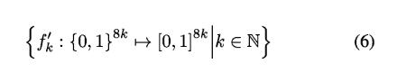

此函数以比特粒度确定有用性。我们通过平均每个字节的组成位值来重构给定的f’。

由于输入的长度和顺序性质不同，回归神经网络（RNN）是显而易见的选择。每个输入文件是顺序数据，最有可能由目标程序顺序解析。 RNN能够统计[21]。这对于在固定偏移处包含标题信息的文件格式进行注释很有用。RNN已经成功地用于统计机器翻译[6]，[3]，这个任务很相似，因为二进制文件格式可以被认为是一种语言。已知RNN具有较长序列的问题。由于这个原因，我们选择长期短期记忆（LSTM）作为我们的基础复发单位[15]。LSTM将循环单元的存储能力扩展到更长的序列。这是通过一个独立的记忆流程来完成的。LSTM还可以“忘记”已经失去其实用性的记忆，这使得更长的序列具有更强的表现力。回想一下，循环单元计算状态更新和输出ht,ot，如下所示。

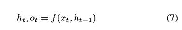

LSTM将上述整体框架分解为以下子组件。

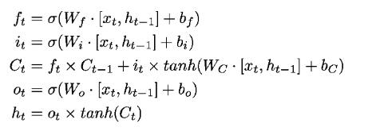

这里

- σ = Sigmoid激活函数

- W* = 学习的权重向量

- b* = 学习的偏向量

忘记门ft和输入门it控制是否忘记旧存储器，以及当前输入是否值得记忆。这种相互作用允许LSTM的存储器信息通过更长的序列持续存在。

我们使用LSTM作为我们的基本重复单元来探索几种架构，以确定输入注释和神经结构。神经机器翻译的最新进展突出了一些重要的架构，如Seq2Seq [6]和Seq2Seq与注意[3]。在学习二进制格式的结构时，这些以翻译为中心的架构是否也能很好地工作？总的来说，我们评估了以下架构：

- LSTM：简单的单向LSTM [15]。

- 双向LSTM：双向LSTM，可以向前和向后看输入。

-  Seq2Seq：序列到序列架构[6]。

- Seq2Seq + Attn：序列到序列架构，注意[3]。

双向LSTM以向后和向前的顺序查看输入。双向LSTM由两个单向LSTM组成，每个LSTM在前向和后向各一个。给定长度为n的序列，为计算时间步长t的值，前向LSTM的h(t-1)和后向LSTM的h(n-t-1)结合使用。合并函数用于合并单向LSTM的输出。合并函数可以是组合两个相似大小的向量（例如求和，乘法或连接）的许多函数之一。我们选择将sum函数用于单层双向LSTM，并将LSTM的连接函数用于两层或更多层。

我们还尝试了每个时间步长提供的层数和LSTM输入的块大小。目的是确定复杂的字节预测是多么复杂，以及更复杂的模型是否优于更简单的模型。

我们的模型每次迭代消耗k位，并且每次迭代也输出k位。我们尝试将输入序列分块为64位或128位块。我们提出的架构和可训练参数的总数详见表II。

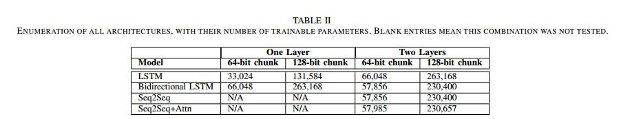

单层双向LSTM使用求和合并功能，而双层双向LSTM使用串联功能。双层双向LSTM的第二层是单向LSTM。Seq2Seq和Seq2Seq + Attn由一个编码和一个解码层组成。编码层是双向LSTM，它使用concatenate函数合并。解码层是单向LSTM。我们没有探索单向Seq2Seq或Seq2Seq + Attn。

# V 评估

我们评估增强型AFL对四个目标计划的有效性，目的是评估实践中遇到的各种程序中的增强策略。选择的目标程序是readpng [22]，readelf [10]，mupdf [16]和libxml [24]。我们调查了这些程序的几个指标，主要包括代码覆盖率和输入增益。代码覆盖率和输入增益是AFL使用的第一类指标。输入增益通过输入总数来测量，这些输入会在模糊器的运行时间内产生输入增益。还测量了使用增强AFL和AFL发现的碰撞次数。

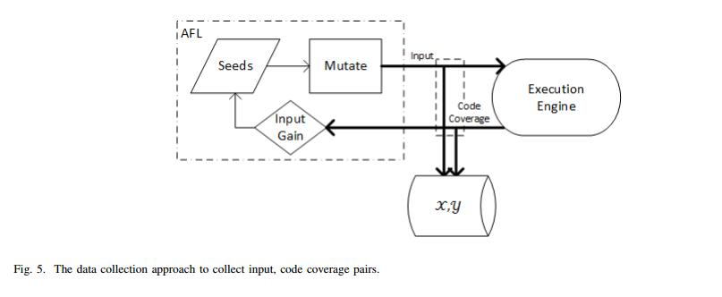

我们从大样本群体中为每个程序收集了180个随机选择的种子文件。种子文件被均匀地分成训练和测试集。为了收集用于训练模型的数据，AFL运行了24小时。以均匀的1％采样率收集输入，代码覆盖对。该收集策略在图5中突出显示。在训练之前，数据以严格小于函数的方式进行过滤，截止值为0以形成训练集。也就是说，给定一组(x,x’,b,b’)，训练数据集X Y如下构造。

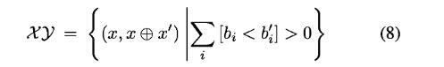

模型实现是使用Keras [7]设计的，这是一个高级深度学习库。我们选择使用Tensorflow [2]作为Keras的低级后端。

训练数据的长度是异质的，并且可以包括长达200千字节的非常大的输入文件。为了缓解这些问题，超过10kB的输入数据被分段为一组10kB段。在分段之后，根据长度对数据进行分箱并填充到最近的块大小的边界。每个训练步骤包括选择与箱尺寸成比例的箱，以及在所选箱中构建元件的小批量。这些模型经过12小时的训练，以确保收敛，并在具有12千兆字节RAM的Nvidia K40M GPU上进行培训。我们使用平均绝对误差（MAE）的损失函数，并使用具有5 x 10^-5^学习率的Adam优化器[17]来训练模型。

尽管Augmented-AFL可以利用以前学过的模式来提高突变的命中率，但它并没有像基准AFL算法那样进行探索。为了抵消这种趋势，对于每个种子，增强型AFL可以以50％的概率选择使用未增强的模糊测试策略。这允许在勘探和开采之间进行良好的混合。有许多技术可以更好地实现我们希望在未来追求的探索和开发之间的平衡。为了评估学习模型，我们在种子文件的测试集上重新启动AFL和Augmented-AFL。该评估阶段进行24小时。为了最小化方差，一次运行许多AFL实例。对于AFL，16个AFL实例在16核机器上运行。对于AugmentedAFL，在16核计算机上运行8个AFL实例，其中8个核保留用于模型查询。对于大多数验证，我们使用Azure标准F16s机器，配备2.40GHz的Intel Xeon E5-2673 v3 CPU和32GB RAM。由于内存不足问题，Azure Standard D14大小的VM仅用于少数情况。Azure标准D14 VM与标准F16相同，只有112GB的RAM。验证期间未启用动态CPU频率缩放。执行24小时后，数据在许多实例上取平均值。

## A.代码覆盖范围

报告表III中所有程序的所有体系结构的代码覆盖率。我们可以观察到readelf和readpng程序的代码覆盖率指标的显着改进。几乎所有模型都优于这些程序的基准（基线AFL）。通常，最简单的单向模型优于其他更复杂的模型。但是，使用mupdf和libxml没有观察到代码覆盖率指标的显着改进。对于mupdf，大多数增强模型的性能都比基准测试差。唯一的例外是mupdf的Seq2Seq + Attn模型，它的性能优于基准。对于libxml，所有模型的代码覆盖率都相似。报告的代码覆盖率都集中在2.10％左右，并且在误差范围内。

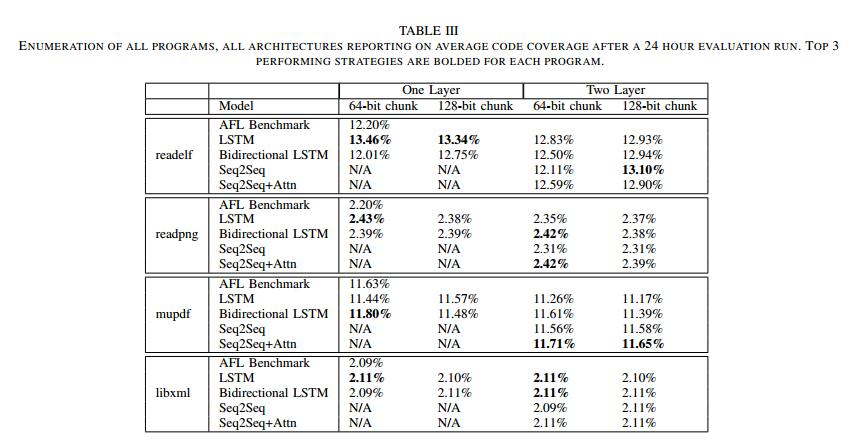

## B.输入增益

衡量效率的第二个指标是输入增益。输入增益是在目标程序中发现的从未见过的行为的路径数。此行为的特征在于执行新的代码块，或者增加先前执行的代码块的执行频率。图6显示了每个程序的两个性能最高的模型的输入增益与时间曲线。

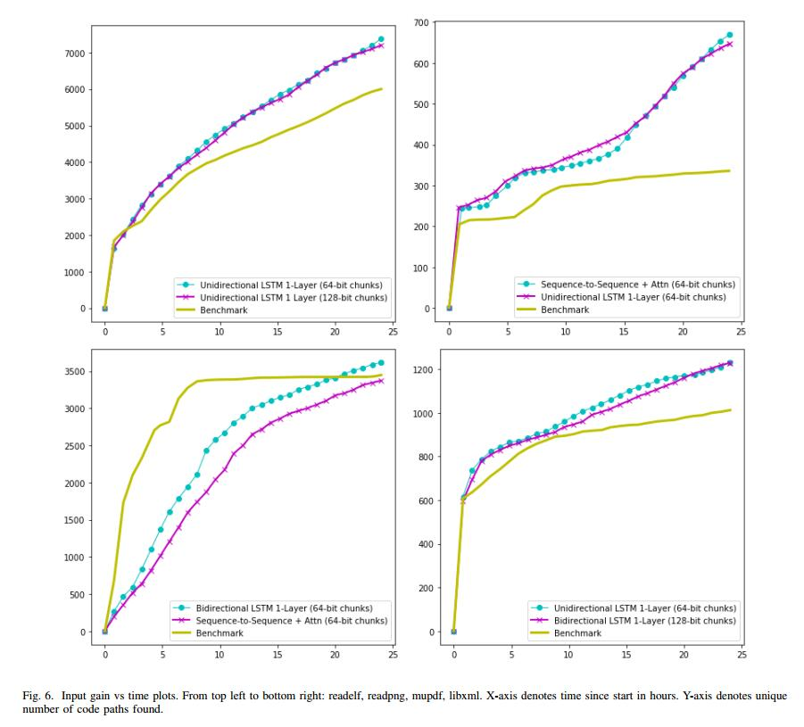

对于除PDF之外的所有程序，都会观察到输入增益的显着改善。这对于readpdf和readelf是预期的，因为这些程序的代码覆盖率通常会增加。但是，libxml在验证期间没有显示代码覆盖率增加。这可能意味着相同的代码部分在执行频率的变化下得到更彻底的运用。

mupdf解析器在代码覆盖率或输入增益方面没有显着改进。我们相信这显示了所提出的设计中的模型查询与执行权衡。由于典型的PDF文件大小非常大（超过100kB），因此模型查询时间会对Augmented-AFL的性能产生负面影响。在对每个种子文件进行模糊测试之前，必须对该种子文件查询模型，对于这样的大种子文件可以是几秒钟。在模糊器的运行时间内，此查询时间会对总模糊测试性能产生负面影响，因为模型查询通常会阻止执行。我们相信，模型查询的吞吐量和性能改进将提高增强型AFL技术对PDF等冗长格式的有效性。

## C.崩溃

测量模糊效应的最重要指标是发现的恶意输入数量，我们通过记录执行期间发现的唯一崩溃数量来衡量。我们只观察了readelf和libxml的崩溃，因此我们省略了readpng和mupdf的图。随着时间的推移发现的独特崩溃图显示在图7中的readelf和libxml中。

增强AFL优于两个程序的AFL基准。对于readelf，在24小时标记处观察到几次独特的崩溃（超过20次），而基准测试没有观察到崩溃。同样，与AFL发现大约80个独特崩溃相比，增强AFL导致在24小时标记内发现大约110个libxml的唯一崩溃。这些结果显示出相对于基线的显着改善。

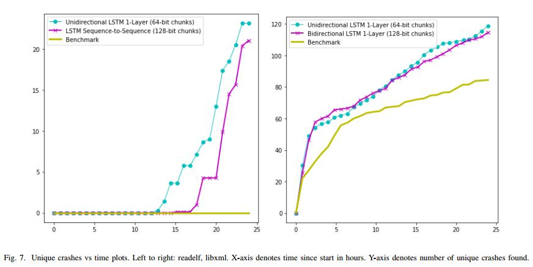

这些结果显示了AFL的改进，AFL是一种遗传算法greybox fuzzer。使用机器学习来预测感兴趣的有趣位置，我们能够改善各种目标程序和文件格式的模糊测试性能。因此，我们认为机器学习引导模糊是一种很有前途的技术，可以改进greybox和blacbkox模糊器，并且可以应用类似的技术来学习将来的其他几个模糊测试参数。

# VI 相关工作

我们现在简要讨论一下使用机器学习技术（特别是基于神经网络的模型）来指导程序模糊测试和程序分析的一些相关工作。

**a）基于语法的模糊测试的机器学习**：最近开发了用于训练神经网络（LSTM）的Learn＆Fuzz [13]方法，以学习基于语法的模糊测试的输入格式的生成模型。对于复杂的输入格式（如PDF），随机改变输入会很快导致无效输入，因此通常使用基于语法的模糊测试技术来定义这些格式的输入语法。但是，手动编写语法是繁琐且容易出错的，尤其是对于复杂的输入格式。Learn＆Fuzz介绍了一种使用LSTM来学习使用字符级模型的PDF对象的语法（分布）的技术，然后可以对其进行采样以生成新的输入。我们的技术不是学习语法，而是使用神经网络来学习预测种子文件中有希望的位置以执行突变的功能。我们相信我们的技术可以补充Learn＆Fuzz，以进一步改善基于神经语法的模糊测试。

**b）Fuzzing的强盗配方**：通过强盗优化技术激发了我们的工作。将模糊测试和强盗优化与模糊配置调度相结合已有一些工作[25]。特别是，Woo等人 [25]将模糊化的配置选项建模为强盗问题。然而，我们的工作通过将模糊测试模拟为强盗问题来进一步采用这种方法。我们认为模糊测试是一个离散的优化问题，可以通过识别具有最高收益的字节位置子集来简化，并且最佳字节位置的识别是通过多臂匪徒方法最好地解决的问题。这种“bytesas-bandits”方法值得进一步研究，特别是，我们希望进一步阐明识别最佳字节的理论上最佳方法。

**c）进化模糊测试**：进化模糊测试使用执行反馈来指导未来的变异决策。沿着这个方向的一些早期工作包括DeMott等人的进化模糊系统（EFS） [8]。EFS使用遗传算法技术来演化种子池，其中定义函数被定义为诱导代码覆盖。EFS使用几种复杂的交叉方法来随时间推移种子池。与AFL相比，EFS仅使用基因交叉方法来“模糊”种子文件集。进化模糊测试的最新进展包括基于Taint的Directed Whitebox Fuzzing [11]和VUzzer [20]。基于污染的定向白盒模糊测试使用动态污点跟踪来识别可能导致危险代码段执行的种子部分。突变针对这些部分以发现错误。VUzzer采用类似的方法使用动态污点跟踪，但不会尝试识别和关注危险的代码段。VUzzer致力于提高代码覆盖率并彻底运用代码。

上述技术中的共同主题是依赖于过去执行行为的反馈循环。虽然我们的方法也包含反馈循环，但我们赞成使用神经方法来指导未来的模糊测试操作。这是新颖的，因为易于开发和集成。我们的神经引导可以使用现成的Deep Learning库快速开发方法，并且可以轻松地将其集成到现有的Greybox或Blackbox模糊器中。我们的方法具有相对较低的开销，因为简单模型具有低查询时间并且可以有效地计算覆盖图。

**d）用于程序分析的神经网络**：最近有几项工作用于训练神经网络以执行程序分析，例如程序修复[4]，程序优化[5]和程序综合[19]，[9]，[23] ]。这些工作学习程序的神经表示来执行各种预测任务，而在我们的工作中，我们训练神经模型代替输入文件。此外，我们的工作提出了训练神经网络的第一个应用，以学习输入文件中有前途的模糊位置。

# VII  未来的工作和结论

我们已经演示了一种新的基于神经的增强灰色框模糊测试。这种增强确定了在种子文件中模糊的有用位置。我们认为大多数二进制文件格式包含很小的部分，这些部分会严重影响程序的执行行为。在这些小部分上聚焦模糊是有用的，因为它们可能在目标程序中产生新颖的执行行为。

我们的增强目标是针对像AFL这样的灰盒模糊器。Greybox模糊器是完美的测试平台，因为它们为每次执行提供代码覆盖率反馈。该反馈用于训练神经网络模型以识别最有希望的模糊测试位置。我们的方法简单易用，可与大多数灰盒模糊器集成。

我们发现像LSTM这样的复现模型很适合这项任务。此任务可以被视为类似于统计机器翻译。近年来，循环模型在统计机器翻译任务上取得了巨大成功。我们使用各种目标二进制文件格式（如PDF，XML，PNG和ELF）评估模型。该模型在除PDF之外的所有目标程序上都明显优于最先进的AFL模糊器。通常，最简单的模型优于更复杂的模型。我们相信PDF上的模型性能显示了在大输入文件上查询模型的成本优势。但是，我们相信可以通过一些额外的性能工程改进PDF等大文件格式的结果。

虽然我们的结果很有希望，但还有很多途径需要进一步开展工作。我们在一个受监督的环境中训练我们当前的模型。这项工作的一个自然延伸是使用强化学习在线学习，以便随着模糊测试过程的进行，模型不断改进。我们相信通过“反馈循环模糊测试”可以大大增强模糊测试，其中过去的执行行为指导未来的突变。我们设想了一种新型的模糊器，它利用机器学习模型来指导其变异决策。Fuzzing提供了高质量结构化数据的宝库。信噪比很高。沿着这条道路的另一个可能的扩展是使用生成模型。我们的模型是限制性的，其中AFL提出的突变被否决。一种更有趣的方法是生成应用于种子文件的突变，我们计划在不久的将来考虑这些突变。

