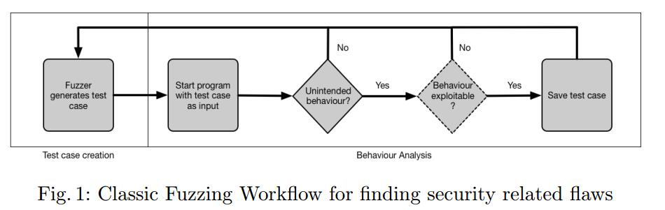
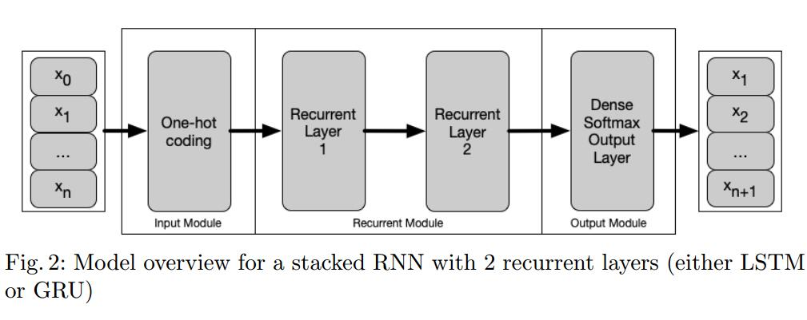
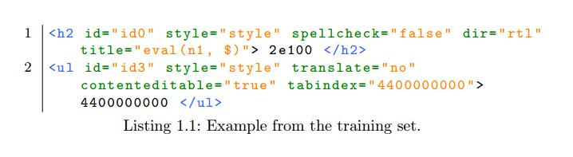
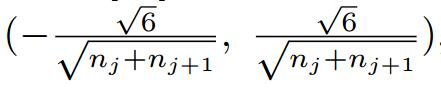
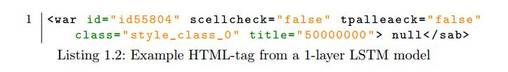
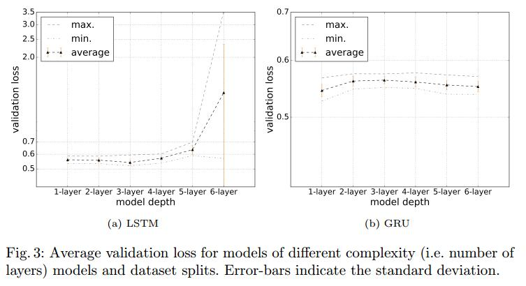
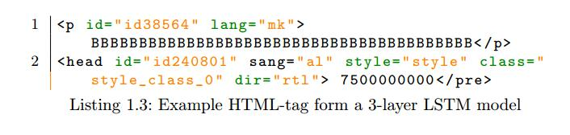
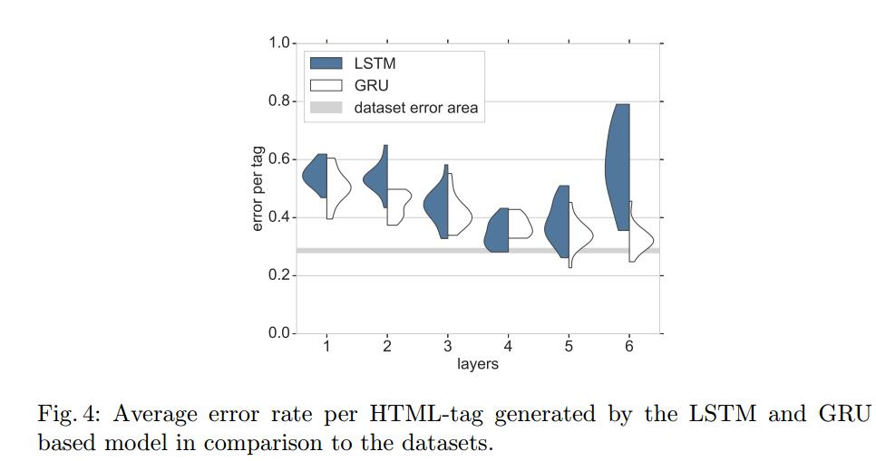
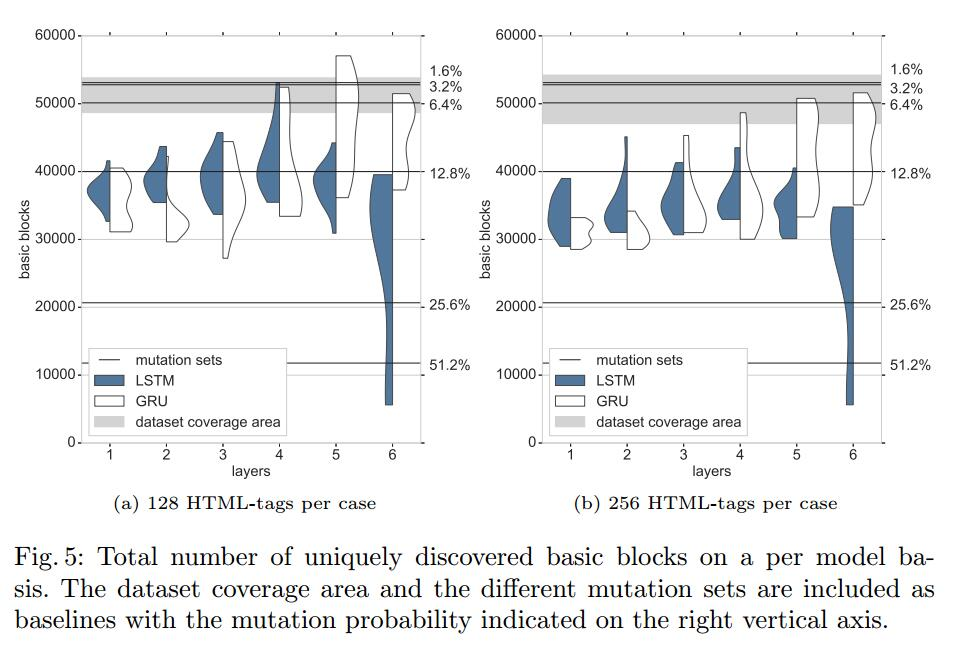
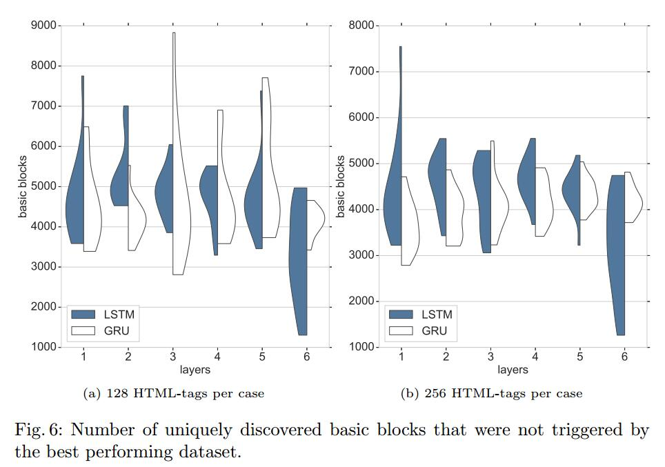

# Abstract

基于生成的模糊测试是一种软件测试方法，能够发现软件中不同类型的错误和漏洞。然而，已知设计和微调经典模糊器以实现可接受的覆盖是非常耗时的，即使对于小规模软件系统也是如此。为了解决这个问题，我们研究了一种基于机器学习的模糊测试方法，其中我们概述了一系列基于递归神经网络（RNN）的测试用例生成器，并使用最少的人工微调来训练那些现成的数据集。与先前的工作相比，所提出的生成器不依赖于启发式采样策略，而是依赖于预测分布的原理采样。我们提供详细的分析，以在具有挑战性的Web浏览器测试场景中演示所提出的生成器的特征和功效。实证结果表明，基于RNN的发生器能够提供比基于突变的方法更好的覆盖，并且能够发现经典模糊器未发现的路径。我们的研究结果补充了其他领域的研究结果，表明使用RNN进行基于代数的模糊测试是通过使用合适的模型选择/分析程序来获得更好软件质量的可行途径

Keywords: Software security, fuzz testing, browser security 

| relevant information |                                                              |
| -------------------- | ------------------------------------------------------------ |
| *作者*               | Martin Sablotny, Bjørn Sand Jensen, Chris W. Johnson         |
| *单位*               | University of Glasgow, School of Computing Science, Glasgow, Scotland |
| *出处*               | ICISC                                                        |
| *原文地址*           | <https://arxiv.org/abs/1812.04852>                           |
| *源码地址*           | <https://github.com/susperius/icisc_rnnfuzz>                 |
| *发表时间*           | 2018                                                         |

# 1. 简介

最近，模糊测试在理论和实际软件测试中越来越受欢迎。这主要归因于在复杂软件系统中触发非预期行为的明显能力，例如，美国模糊Lop（AFL）[28]发现的错误摘要，并通过在微软和谷歌等软件公司中使用模糊测试进一步证明（例如通过他们的开源工具ClusterFuzz [12]），它在许多不同的领域显示了成功和适用性。然而，将一组输入示例上的变异与进化方法相结合的标准方法有其局限性，即增加关键词的必要性和对句法规则的遵从性（例如，在本工作中考虑的HTML）。这些问题可以通过基于生成的模糊器解决，这些模糊器能够遵守这些规则，使用正确的关键字并生成新的输入。传统上，开发基于生成的模糊器所需的时间取决于输入规范的复杂性。例如，为网络协议开发生成器的时间较少，与使用各种字段和状态实现文件传输协议（FTP）[16]相比，它具有三个不同可能值的单个字段。此外，有必要在引入的错误和总体正确性之间找到适当的平衡，以触发导致意外行为的代码路径。

开发基于生成的模糊器的主要瓶颈是需要严格理解和实现输入文件格式。因此，必须仔细研究潜在的复杂输入规范，将其转换为测试用例生成器，然后需要对其进行微调，以便在测试用例中找到正确性和引入错误之间的正确平衡。这种隐式优化过程通过生成在给定规范的某些区域中偏离的测试用例来寻求最大化代码覆盖，因此能够执行不同的低级执行路径。因此，很明显，可以自动推导或减少输入规范的方法将能够通过更快地部署基于生成的模糊测试技术来加速软件测试。这可能会导致软件安全性和稳定性的提高。

学习输入规范（例如语法规则）显然不是微不足道的，特别是由于可以应用输入规范的长时间依赖性。这些依赖性对特定位置的可能输出具有直接影响，因此必须通过学习算法捕获以产生规范附加输出。然而，生成机器学习模型的最新进展（[26]，[3]，[6]，[2]）已经证明了机器学习模型如何用于从实例中学习复杂的规则和分布，并从获得的知识中生成新的例子。

Godefroid等人的模糊测试已经对这些进行了改进[11]。他们演示了如何使用深度神经网络生成PDF对象，这些对象被用作渲染引擎的输入。这些输入文件能够在渲染引擎中触发新指令。然而，他们关注的是学习正确的输入结构和模糊测试之间的紧张关系，换句话说，他们在遵守学习规范和偏离规范之间寻求平衡。他们没有提供对学习过程本身的分析，也没有对基于简单变异的基线进行比较。此外，他们没有提供有关基线与其拟议抽样策略之间重叠的任何信息。为了在模糊测试中使用深度学习模型，重要的是要看它是否值得探索和训练。因此，有必要将其与易于实现的方法进行比较，如简单的变异算法。对不同方法之间现有重叠的分析还可以更深入地了解模型和采样选择，因为在测试期间触发尽可能多的新执行路径以找到触发意外行为的路径非常重要。

在这项工作中，我们研究了如何训练具有不同类型细胞的递归神经网络（RNN）并将其用作HTML模糊器。模型在基于生成的HTML-fuzzer创建的数据集上进行训练，这使我们能够快速，系统地调整数据集大小和复杂性。
我们使用这些模型从生成的概率分布中生成新的HTML标记，这些标记用于形成测试用例。这些是用Firefox [19]执行的，用于收集他们的代码覆盖率数据，并与来自数据集的HTML标记和简单变异数据集生成的基线进行比较。因此，本文的贡献包括： 

- 用于训练和评估具有不同类型细胞的递归神经网络的系统且稳健的方法，用于HTML模糊测试。

- 用于模型选择的过程和度量，并比较机器学习模糊器与标准和基于普通突变的方法（包括基于相似性的分析）

- 对Web浏览器进行广泛的实证评估，证明学习的模糊测试器能够胜过标准测试方法。

- 通过Github 开源了实现代码和数据。

# 2.背景

## 2.1模糊测试

模糊测试是一种动态软件测试方法，因此动态意味着被测软件实际上是与静态分析相对应的。模糊测试的目标是引发在早期测试阶段未检测到的意外行为，因此测试中的软件使用由所谓的模糊器创建的输入执行。这些输入不完全符合基础输入规范，以便找到导致触发意外行为的状态的路径。我们对非预期行为采用广义定义，这使其适用于各种软件和设备[27]。例如，在模糊测试桌面软件期间，意外行为可能是正在运行的进程的终止，甚至可能是对进程进行控制的可能性。在Web应用程序测试期间，非预期行为可能被定义为信息泄漏或规避访问限制，这两种情况都可能由于SQL注入漏洞而发生，其中任意输入用作有效的SQL语句。

正如这些例子所强调的那样，如果可以为攻击者提供优势，那么意外行为就会变得更加严重。这里的优势可能意味着从访问受限信息到接管设备的控制。为了找到这些漏洞，使用了模糊测试。模糊测试期间的一般工作流程如图1所示。测试本身分为两部分，第一部分是测试用例生成，第二部分是行为分析。通常，在模糊测试期间创建测试用例可以分为两类：基于突变和基于生成[27]，[8]和[20]。基于突变的模糊测试使用有效的输入集和变异模糊，以便从输入集中导出新的测试用例。如果输入示例可用（例如JPG文件），则可以快速实现这种类型的模糊测试。主要缺点是基于普通变异的模糊测试创建的测试用例无法快速发现调用树深处的代码路径，因为许多创建的测试用例在早期程序执行阶段被过滤掉。这一类别的一个非常突出和成功的例子是前面提到的fuzzer AFL及其进化突变方法。其次，基于生成的模糊测试使用一种从头开始创建测试样例的方法，例如通过基于语法的创建。在研究输入结构和开发生成器时，这种方法需要付出很多努力，但一般来说它能够发现更深层次的代码路径。但是，必须找到遵守规则和打破规则之间的平衡，以便在目标中引发意外行为。

## 2.2 回归神经网络

许多软件产品的输入数据在互联网上很容易获得（例如HTML，JPG，PNG），深度学习算法已经在不同的使用案例中显示出它们的性能，特别是在大型可用数据集上训练的情况下，例如文本生成[26]，程序创建[3]和机器翻译[6]，[2]。这导致我们在模糊测试期间使用生成模型来创建测试用例。此外，HTML和其他输入格式的结构，其中实际字符或字节依赖于序列中的先前位置导致使用RNN。

RNN用于建模顺序数据，例如用于文本生成[26]，语言建模和音乐预测[21]。他们使用隐藏状态作为短期记忆，在时间步之间传递信息。传统RNN通过输入xt和隐藏状态向量ht和输出 y^t在时间步骤 t 定义如下:
$$
h_t = f_h(x_t; h_{t−1}) ; y_t = f_o(h_t);
$$
fh和fo分别是隐藏层转换函数和输出函数。因此，输入xt可以是N维向量，表示输入结构，例如位置t处的单个像素的RGB值。

正如Hochreiter [13]和后来的Bengio等人所述[4]，RNN受到消失或爆炸梯度问题的影响。这意味着在训练期间权重更新变得无穷小，这会消耗大量时间但不会导致更好的网络优化。 Hochreiter和Schmidhuber引入了长短期记忆（LSTM）细胞的概念[14]使用这些细胞的RNN不会遭受消失（爆炸）梯度问题。 LSTM单元使用隐藏状态，候选值和三个门，即忘记门，输入门和输出门。门控制了多少信息被遗忘，从输入中使用并分别控制流进入新的隐藏状态。它们是默认的前馈神经网络，每个都有自己的可训练参数。

另一种流行的RNN细胞，门控递归单位（GRU）由Cho等人引入 [6]。该单元仅使用两个门，一个重置门和一个更新门。这里，重置门控制忘记过去隐藏状态的哪些信息，并且更新门控制信息流进入新的隐藏状态。这种更简单的模型可以说比基于标准LSTM的模型更容易训练。

当学习用于测试用例生成的输入格式结构时，学习顺序结构的能力（其中存在对先前输入的依赖性）显然是重要的特征。这在例如HTML中尤其明显，其中在开始标记和对应的结束标记之间存在长期依赖性。

# 3堆叠RNN用于HTML-Fuzzing

本工作中使用的模型的基本概念如图2所示。该模型由三个模块组成。首先，输入模块，让X = {x1, x2,… xn}是输入值的序列，其中xt ∈N0 | 1 ≤ t ≤ N，其中xt是表示输入序列中位置t处的字符的自然数。例如，字符'f'在输入序列中的位置t，其分配的数字是17，xt = 17。

然后输入模块采用这样的xt并将其转换为 I = max（X）+ 1的单热编码矢量 x’t ∈ R^I^，使用0来添加到条目中。
设x‘t =（ x’1， x‘ 2，… x‘I）|然后
$$
x’_j = 0 \forall 1≤ j≤ I：j \neq x_t ∨ x_j = 1 \Leftrightarrow j = x_t
$$
对于前一个示例字符'f'，所有 x’j = 0，除了x’17，等于1.从整数值转换是必要的，因为我们将输入解释为分类数据（每个字符是它自己的类别），这些类别是在训练过程中作为特征处理。

 其次，循环模块由LSTM或GRU节点组成，如2.2节所述，s,l ∈N。这里s是节点的内部大小，l是所使用的层的数量，例如，如图2所示对于基于LSTM的模型，l = 2。与Chung等人证明的基本RNN方法相比，LSTM细胞已经证明了高性能增益 [7]。 Cho等人[6]介绍的门控递归单元（GRU）表现类似于LSTM细胞[7]，但Jozefowicz等人 [17]表明LSTM细胞在XML建模过程中表现更好。我们决定评估两个单元的性能，以分析XML建模结果是否可以转换为HTML建模。

最后，输出层由具有I节点的默认前馈网络组成。它将最后一个回归层ht^l^  ∈ R^s^的输出作为输入值，并且在计算其输出之后应用softmax函数。得到的y’t提供用于预测输入序列的下一个值的概率分布。训练期间的目标是最小化交叉熵损失函数
$$
L(Θ) = − \frac{1}{N}
\sum_{i=1}^N
y_ilog(y'_i) + (1 − y_i) log(1 − y'_i);
$$
其中Θ表示模型的参数（即W和b的集合）。为了找到使上述损失L最小化的Θ，应用ADAM [18]优化算法。它是一种基于梯度的优化算法，与其他算法相比，它只需要一阶梯度并且具有减少的内存占用。此外，Dropout（30％丢失概率）[25]用作正则化。

# 4 实验

以下部分介绍了用于验证我们的RNN应用程序的方法，以生成模糊测试复杂系统中网络安全性的测试用例。

基本思想是在大量HTML标签上训练具有不同深度的上述神经网络。在训练之后，这些模型用于直接使用给定序列的字符的概率分布来生成HTML标签。然后将生成的输出用作Web浏览器的输入。对该浏览器进行检测，以便在基本块的基础上执行期间收集代码覆盖率数据。然后使用所收集的代码覆盖率数据来与通过执行数据集的HTML标签收集的代码覆盖率数据以及对该HTML标签执行的普通变异策略比较模型的性能。

## 4.1环境设置和实现

模型训练在配备单个NVIDIA GeForce 1080 Ti和NVIDIA GeForce TITAN Xp的Ubuntu 16.04系统上进行，通过利用其并行计算功能缩短了必要的训练时间。这些模型是使用Google的TensorFlow框架[1]及其Python绑定实现的。该框架已经为我们的模型提供了必要的单元类型，优化算法和损失函数，缩短了开发时间。

代码覆盖率数据是在运行Ubuntu 16.04和Firefox 57.0.1的虚拟机（VM）上收集的，它允许在所谓的无头模式下运行。在此模式下，Firefox不显示图形用户界面，但仍会呈现网页。我们还修改了标准配置，以便禁用内部服务，以避免尽可能多的错误代码覆盖数据。
此外，安全模式已禁用，因为在自动代码覆盖率收集期间，Firefox未正确关闭，因此可能会在几个测试用例后尝试以安全模式启动。无头模式的使用还节省了代码覆盖率收集期间的时间，这是由DynamoRIO的drcov工具收集的（参见第4.4小节）。 VM本身使用16 GB的RAM和固态硬盘。 VM用于通过克隆和部署到多个主机系统来促进并行数据收集。

## 4.2数据集生成

为了提供可重复和可控的实验，训练（和地面实况）数据集由PyFuzz2 [24]中包含的现有HTML-fuzzer生成。它提供了一个可控制的发生器，从而确保与从互联网收集数据集相比，训练数据集内变化的不确定性更小。因此，可以在每个标记的基础上控制生成的HTML的复杂性，而必须解析收集的集合，然后对不需要的HTML标记进行过滤以控制结果数据集。

修改了预先存在的模糊器，以避免嵌套HTML标记，删除所有级联样式表并每行输出一个HTML标记。由于没有嵌套HTML标签的限制，有些像td或th被排除在外，因为它们需要在此示例表中使用外部标记。引入这些限制是为了通过降低整体数据集的复杂性来减少对基本问题的关注。这进一步降低了必要的模型复杂性并有效地缩短了训练这些模型所需的时间。

清单1.1显示了用于训练模型的数据集的摘录，其中突出了上述修改。创建的文件由409,000个HTML标记组成，总大小为36MB。

## 4.3训练

所有模型都经过训练可以预测每个字符的输入其中一个偏移。例如，将清单1.1中第1行的“<h2 i”作为长度为5的输入序列，然后该特定输入序列的标签将为“h2 id”。在训练期间使用的实际序列长度是150个字符，并且每个模型被训练50个时期，这已经足以使模型收敛。为了训练模型，我们使用了前面提到的ADAM [18]优化算法。起始学习率设定为0.001，每10个时期减半。训练模型的分批大小为512。对于所有受过训练的模型，LSTM和GRU单元的内部大小设置为256，层数从1到6变化。层的权重由Glorot uniform initializer初始化[10]。因此，权重是从区间中的均匀分布

中绘制的，其中nj是层j的内部大小。

数据集的前30MB用于训练，另外1MB用于验证。所有模型都经过5次不同的训练/验证分裂训练，重复3次，不同的初始化（以减轻极差的局部最小值），这导致每个细胞类型共有90个训练模型。随机选择分割而没有重叠部分。

## 4.4 数据收集

代码覆盖率数据是通过执行由DynamoRIO的drcov [9]插桩Firefox收集的。该工具收集有关被测程序的已执行基本块的数据。收集的代码覆盖率数据被解析为Firefox的libxul.so库中唯一执行的基本块，其中包括负责HTML呈现的整个Web引擎。即使重新启动过程，也可以识别这些基本块，因为记录的数据使用基本块与存储器中库的基址的偏移量，并且对于固定版本，此偏移量始终相同。因此，基本块被定义为具有单个入口（分支目标）和单个出口（分支指令）的机器指令的线性序列。

所有测试用例都包含一个基本的HTML模板，HTML标签插入到body标签中。初步实验表明，多次执行相同的测试用例会返回不同的代码覆盖率数据。这是由于捆绑在libxul.so库中的其他函数，它们不是Web引擎本身的一部分。例如，这些功能可以仅在多次重启之后或以固定的时间间隔执行。为了识别相应的基本块，执行空白HTML模板1024次，并将结果代码覆盖存储起来供以后使用。

通过使用HTML模糊器创建6×16384 HTML标签来建立比较基线然后使用16384个HTML标签的每个集合来创建两个数据集，一个包含64个文件，每个文件具有256个HTML标签，第二个包含128个文件包含128个HTML标签。这导致了12个数据集。

通过使用HTML模糊器创建6×16384 HTML标签来建立比较基线然后使用16384个HTML标签的每个集合来创建两个数据集，一个包含64个文件，每个文件具有256个HTML标签，第二个包含128个文件包含128个HTML标签。这导致了12个数据集。
为了建立第二个比较基线，通过改变数据集测试用例并从中收集代码覆盖率来创建其他测试集。应用了一个简单的变异函数，其中一个位置被随机选择的字符（只有已经存在于数据集中的字符）替换。结果是另外20个测试用例集，10组由128个案例组成，每个案例有128个HTML标签，10个组由64个案例组成，每个案例有256个HTML标签，总共有1920个案例。
替换概率在0：1％和51.2％之间变化。这样做是为了确保存在差异，因此有动机使用经过训练的模型来创建测试用例，而不是实现基于简单变异的方法。
对于每个训练的模型，生成总共16384个HTML标签，然后用于创建两组不同的测试用例。第一组每个案例使用128个HTML标签，每个模型训练产生128个案例，而第二个案例每个案例使用256个HTML标签，每个模型产生64个案例。这样做是为了分析HTML标记对代码覆盖率的影响，并观察与模型性能的关系。 HTML标签是通过使用“<”字符作为起始输入生成的，从得到的概率分布中抽取下一个字符，然后将其用作新输入。重复此操作直到采样“\n”（换行符），因为它标记了HTML标记的结束。

最后，计算来自测试用例的基本块集合和空白案例之间的集合差异，以过滤掉上述不相关的基本块。

## 4.5 结果

训练阶段已显示两种细胞类型之间的行为差异。基于LSTM的模型显示平均验证损失和标准偏差降低至三层，如图3a所示，之后有所增加。特别是，与其他模型相比，6层模型显示出较大的标准偏差和平均验证损失的大幅增加。这表明这些模型具有太多参数，以便对我们的问题和训练集进行训练。从一般的机器学习角度来看，这种行为是可以预期的，并且因为与使用生成神经网络的其他类似应用相比，训练过程是相同的，例如生成文本。

相比之下，基于GRU的模型的训练显示从1层模型到2层情况的小幅增加，但之后随着标准偏差的总体小差异而减小。这表明基于GRU的模型或者更适合于再现输入结构，或者没有达到基于6层LSTM的模型的整体复杂性，这也通过比较这些模型的可训练参数来支持。基于GRU的模型有2, 276,971比3, 026, 795。

总的来说，验证丢失的一个小的数字差异可能导致生成的HTML标签的质量有很大差异。例如，清单1.2显示了由1层LSTM模型生成的摘录。它几乎不可识别为HTML，并且模型没有生成现有的HTML开放和结束标记，并且在这个特定示例中，两个生成的HTML属性拼写错误。与此相反，清单1.3显示了由3层LSTM模型生成的两个HTML标记。两者都只使用现有的HTML标记，但第二个不使用正确的结束标记和拼写错误的一个属性名称。图4提供了关于两种细胞类型模型之间质量差异的进一步证据。它显示了每个标记的HTML错误率如何跟随验证损失的趋势，并突出显示小差异对HTML质量的影响很大。 6层LSTM HTML错误率的高扩散反映了训练期间观察到的大标准偏差。

- **具有128个HTML标签的测试用例**

在 代码覆盖性能方面，整体趋势也遵循验证损失和标准偏差，其中较小的验证损失和标准偏差表示更好的性能。图5a显示了每层两种细胞类型的总发现基本块。它强调两种类型的4层模型和GRU 5和6层模型都能够发现数据集范围内的基本块，甚至超越它。

此外，图6a显示了基本块数量与性能最佳数据集的差异。它表明所有模型都能够发现不是由数据集触发的基本块，而5层GRU模型平均表现最佳。与不同的突变组相比，最大重叠率达到90％，突变几率为1.6％，这并不奇怪，因为相同的突变组与性能最佳的数据集重叠87.6％，如同图7.表现最佳的5层GRU模型与不同突变机会的结合重叠78％，突出了模型发现基本块的能力，这是简单突变方法无法触发的。总体上表现最佳的模型也是与数据集重叠最多的模型。

- **具有256个HTML标记的测试用例**

具有256个HTML标记的测试用例的代码覆盖率结果各自显示类似的探索，但总体性能略低，如图5b和图6b所示。预期整体性能较低，因为两个运行基本上使用相同的HTML标签，并且只有插入的HTML标签的数量不同。

就绝对基本块而言，4层模型是最好的基于LSTM的模型，但是在此设置中它没有到达数据集覆盖区域。然而，基于4层，5层和6层GRU的模型能够到达数据集覆盖区域，其中6层模型具有最多数量的唯一触发的基本块。
考虑到与突变测试用例的重叠，总体结果与128个HTML标签的情况相同。表现最佳的四层模型与74.6％的突变集平均重叠。这表明256个HTML标签案例也能够在Web渲染引擎中触发新的代码路径。

# 5讨论

结果表明，使用基于RNN的模型成功训练模型和生成测试HTML案例确实是可能的。但是，监控此过程以获得稳健的结果至关重要，例如，6层LSTM模型无法以可靠的方式进行训练。这很可能是由于缺乏训练数据或优化中涉及的大量参数。

一旦对模型进行了训练，结果表明平均验证损失可以用作良好的初始选择标准，用于选择用于生成测试用例的良好模型，尽管隐式耦合代码覆盖度量。这是特别有趣的，因为在模型选择阶段没有可用的代码覆盖数据，并且在模糊测试期间覆盖尽可能多的代码路径对于发现软件错误很重要。结果还表明，HTML错误率可用于确定良好的生成模型，从而增加选择过程。这尤其有用，因为仅平均验证损失和标准偏差可能表明两个模型之间的差异较小，例如参见清单1.2和1.3。这些模型之间的最高平均验证损失差异≤0.02，但HTML错误率的差异为0.3。这意味着性能最差的单层LSTM模型每个标签的误差是最佳性能的3层LSTM模型的两倍。

总体而言，表现最佳的模型比其他模型生成更有效的HTML标签，从而导致使用现有的HTML标签。那些生成的和通常有效的HTML标签并不总是用正确的相应HTML标签关闭。这导致性能最佳的模型偶然构建嵌套的有效HTML标记，因为这些模型使用有效的开始HTML标记，但不生成相应的结束HTML标记。但是，这可能仍会在文件的后续阶段生成。假定的呈现行为和嵌套HTML标记的创建会触发基线集未触发的代码路径，因为在基线集中，每个打开的标记都会被关闭，每行中都有相应的结束标记。

LSTM模型与基线集之间的重叠基本块（参见图7a）的相似性低于128个HTML标签情况下与突变集和彼此之间的模型的重叠。这可能表明模型无法完全复制给定的输入结构，因此另一个模型选择更适合学习此结构，或者所提供的训练集太小而无法使用所选的模型体系结构捕获输入结构。对于GRU模型，表现最佳的模型还显示与数据集的重叠高于具有变异集的重叠（参见图7b）。这进一步加强了这样的假设，即模型必须达到一定的质量才能表现良好。

总的来说，我们能够证明特别是基于GRU的RNN能够创建HTML标签，然后可以在浏览器的模糊测试中使用。至关重要的是，生成的HTML测试用例还能够触发大量独特的基本块，而数据集的基线和简单突变方法无法实现这些基本块。

# 6 相关工作

最接近的相关工作由Godefroid等人完成 [11]。他们使用两层堆叠RNN来研究可实现的代码覆盖率，以对PDF对象进行采样，并重点关注训练持续时间对此的影响。将他们实现的代码覆盖率结果与基线进行比较，该基线是从训练集中随机选择的。与此相反，我们使用模型在训练阶段未见的数据来建立我们的比较基线。此外，他们分析了创建测试用例的不同方法并对其进行了比较。他们还强调了学习和模糊测试之间观察到的紧张关系，并提出了一种名为SampleFuzz的算法。如果模型的最高预测概率高于某个阈值并且随机抛硬币成功，则该算法使用最低预测概率。虽然我们的工作研究了不同的输入格式，即HTML，与PDF对象相比，它是一种结构更依赖的输入格式。我们还研究了模型深度对结果代码覆盖率的影响。我们无法观察到前面描述的学习和模糊测试之间的紧张关系。这可能与我们训练集的相对较大的大小有关，或者表明他们的模型开始过度拟合训练样本，因此需要额外的随机性来产生新的测试用例。无论如何，我们没有确定是否需要引入额外的随机值（例如，通过使用SampleFuzz）。

其他相关工作在执行期间利用控制和数据流来生成新的测试用例。 Rawat等人[23]利用所谓的进化算法来推导新的测试用例。而Hochele等人[15]从收集的执行信息中导出输入语法。这两种方法都需要直接访问被测程序以对其进行检测并收集必要的数据。相反，我们的方法能够直接从输入示例中学习输入结构，这缩短了设计和学习过程。

Bohme等人提出了一种利用代码覆盖和基于突变的模糊测试的不同方法 [5]。他们在突变过程中用马尔可夫链增强了AFL。他们的AFLFast调用方法使用Markov链来确定状态转换为新的测试输入。他们已经证明，他们缩短了在一组经过测试的软件中发现错误所需的时间。但是，它们没有提供任何有关高度依赖结构的输入格式的信息，如HTML，这被描述为一般AFL方法的不足之处。

Pradel等人评估了另一种结合深度学习以便在软件中发现错误的方法 [22]。他们使用训练有素的模型来分类潜在的错误源代码。因此，他们将他们的模型训练为特定错误类别的单独分类器。与之相反，我们训练模型生成输入，然后可以用来触发和观察软件中的错误。此外，他们的方法需要直接访问源代码，而我们需要访问足够的输入示例来训练RNN模型。

# 7 结论和未来工作

我们的工作提供了证据，证明可以使用堆叠的RNN生成HTML标签，以便为浏览器的渲染引擎进行模糊测试生成新的测试用例。结果还清楚地表明，即使训练参数较少，基于GRU的模型也能够胜过LSTM模型。此外，所提出的评估程序和基于相似性的分析表明，数据集与模型生成的测试用例之间的基本块的重叠平均非常低。此外，与简单突变组的重叠平均约为70％，这表明训练的网络能够发现以前未通过具有不同突变机会的幼稚突变方法发现的新代码路径。这提供了一个明确的证据，即只要应用合适的模型选择和分析程序，RNN就可以被训练并用作有效的HTML模糊器。

我们目前正在寻求以至少三种方式扩展目前的工作：首先，研究更复杂/更合适的神经网络模型对于提高生成的HTML的整体质量是必要的，因为其他流行的Web技术（如JavaScript）不能用于破坏的HTML标签都有效。其次，重要的是验证当前关于真实HTML示例的工作的概括，与此处考虑的模糊器生成的训练数据形成对比。最后，我们正在探索在训练过程中利用收集的代码覆盖率数据的方法，并在发现意外行为或新代码路径时奖励学习算法。我们推测这可以通过强化学习来实现，以系统地权衡模型拟合与探索。